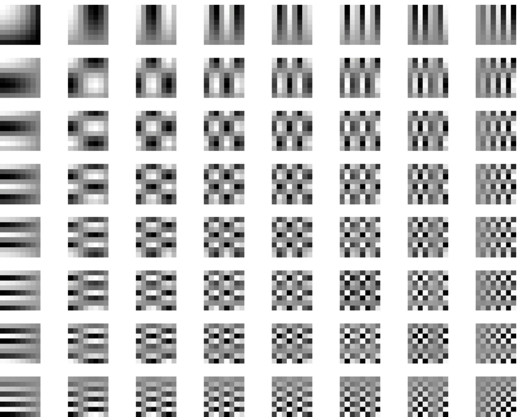
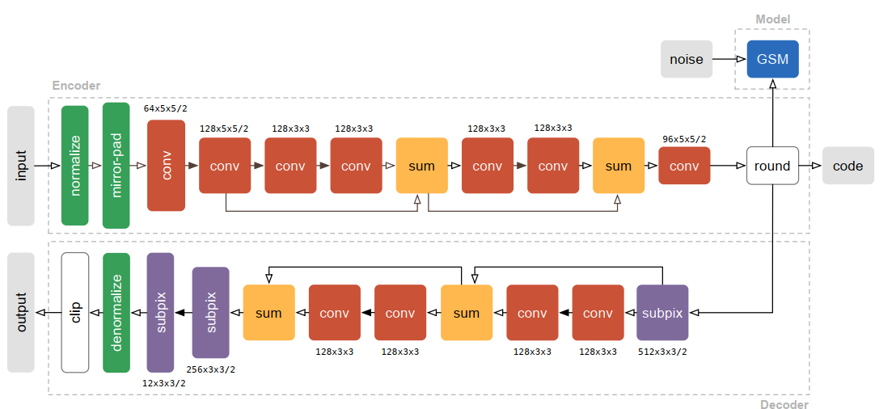

# Introduction

Image compression is an important task in computer science and engineering.

Two main approaches:
1. Lossy (estimating information). JPEG, MP4, MP3 etc.
2. Lossless (compressing information). DEFLATE, HEVC, H.256 etc.

Discrete cosine transform (DCT), Huffman coding.

---

# Image compression

It is common to use Fourier transform based methods in image compression. A popular implementation of Fourier transform for discrete functions is Discrete Cosine Transform.

However this is not the only one approach. Instead of using a predefined polynomial to encode an image, it is possible to use neural networks to pack and unpack information.

---

# Neural networks in compression

There were several approaches to apply neural networks architecture in image compression. Take an autoencoder architecture as an example:

---

# Project statement

How do we memorize image or visual scene in our life. We do not operate in terms of pixels or object coordinates. More likely we use something like scheme, which describes the most important parts of an image.

There are already algorithms capable to extract Scene Graphs form image. There are some approaches to generate an image from scene graphs. We can combine those two.

---

# Approach and methodology

A general approach is to use two models: one model will be used to generate intermediate representation, another one will be used to restore an original image from its representation.

---

# Image scene graph

On the left we can see an image scene graph.

---

# General pipeline

First scene graph and convolution features are obtained. Then this can be treated as a compressed representation of initial image. It can be sent through network or being stored on machine. When the original image is needed we can feed this representation to generative model to obtain initial image.

---

# Scene graph example

**Scene graph generation general view.** The left part is original image, the middle part is image with detected objects and the right part is scene graph that can be obtained from such image.

---

# Scene graph generation

---

# Image generation pipeline

General pipeline to generate an image from an arbitrary scene graph.

---

# Data

Visual Genome dataset consists of more than 100,000 images labeled with scene graphs.

Dataset structure:

1. Images.
2. Detected objects information (coordinates of rectangles for each object, objects labels, objects attributes).
3. Scene graphs, obtained from images.

Images are in JPEG format with various height and width.

---

# Potential outcomes

Potential application niches:

1. Limited space on machine with high computational power.
2. Huge images needed to be transmitted through a network with limited speed.

---

# Potential limitations

The quality of restored images could be not as good as it needed. 

This problem can be solved by storing an additional information about an image such as scene and objects convolutional features.

---

# Future planing

After the primary research it is clear that the model is not as easy as it thought to be before.

Future plans include:
 - Setting up a model
 - Training the model in a lab
 - Making publications
 - Summarizing a research result in final thesis

---

# Model

1. Set up a SGG model
2. Set up a generative model
3. Adjust parameters

---

# Publications

During this research it is possible to make several publications. Since the middle part of the model is not clear yet, now we can only talk about compression algorithm in general.

It is highly possible that there will be several improvements, that then can be summed up in another publication.

---

# Conclusion
