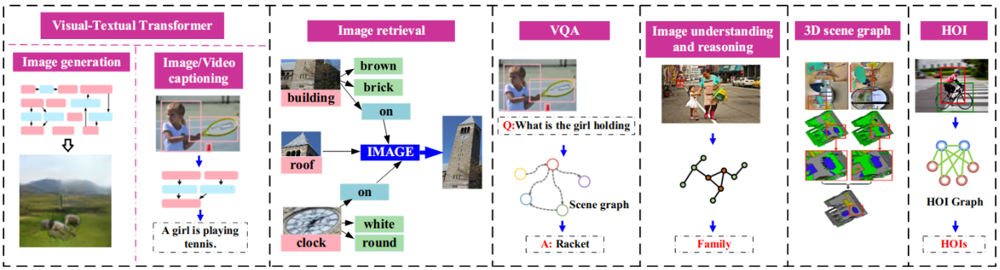

# Introduction

This is a simple introduction [@fig:fig1] [@eq:equation1]

{#fig:fig1}

$$
x=x+1
$${#eq:equation1}

TTTThe option --from=markdown tells that input file is a Markdown file. Markdown extensions +tex_math_single_backslash and +tex_math_dollars enable Pandoc to parse equations.

Pandoc-citeproc enables us to use citations in Markdown. Pandoc installation includes it by default. We need to enable it by using the option --filter pandoc-citeproc.

We can execute the Makefile command in the terminal as follows.he option --from=markdown tells that input file is a Markdown file. Markdown extensions +tex_math_single_backslash and +tex_math_dollars enable Pandoc to parse equations.

Pandoc-citeproc enables us to use citations in Markdown. Pandoc installation includes it by default. We need to enable it by using the option --filter pandoc-citeproc.

We can execute the Makefile command in the terminal as follows.he option --from=markdown tells that input file is a Markdown file. Markdown extensions +tex_math_single_backslash and +tex_math_dollars enable Pandoc to parse equations.

Pandoc-citeproc enables us to use citations in Markdown. Pandoc installation includes it by default. We need to enable it by using the option --filter pandoc-citeproc.

We can execute the Makefile command in the terminal as follows.he option --from=markdown tells that input file is a Markdown file. Markdown extensions +tex_math_single_backslash and +tex_math_dollars enable Pandoc to parse equations.

Pandoc-citeproc enables us to use citations in Markdown. Pandoc installation includes it by default. We need to enable it by using the option --filter pandoc-citeproc.

We can execute the Makefile command in the terminal as follows.

# Reference