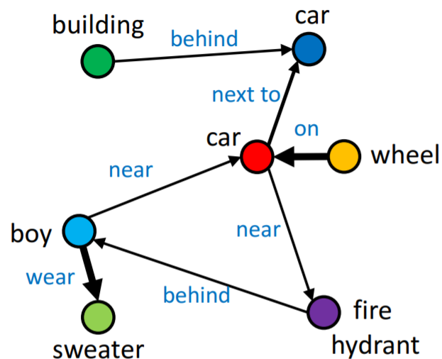
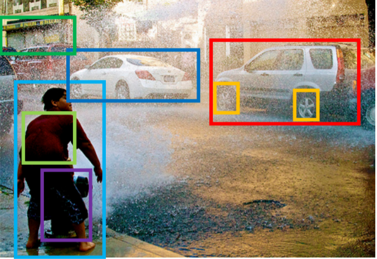
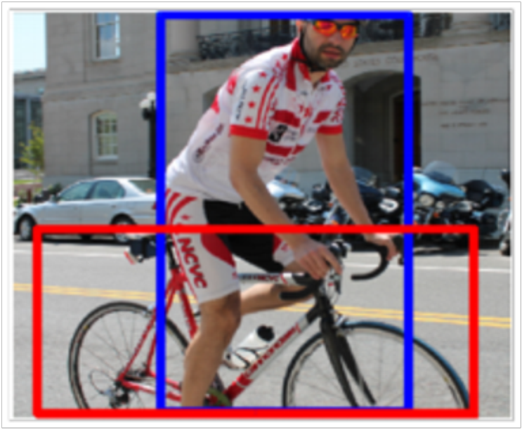
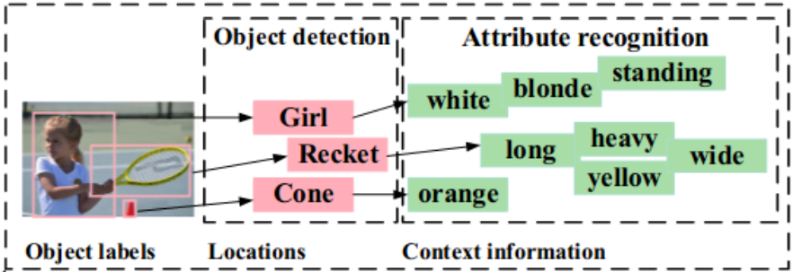
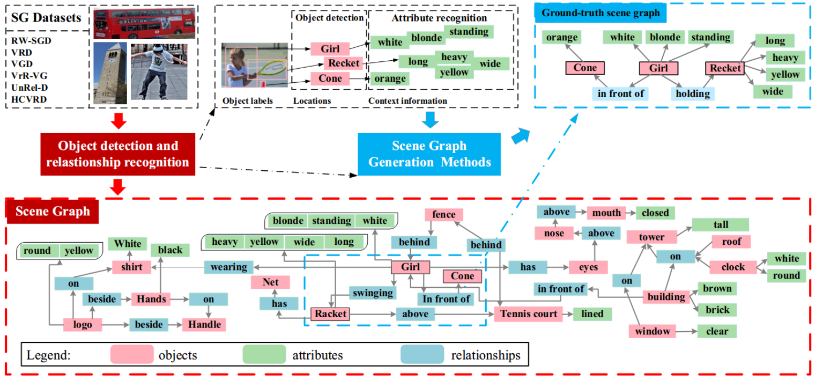
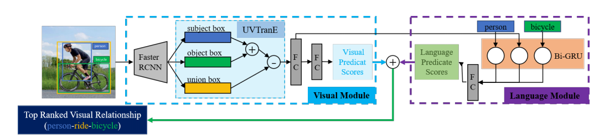
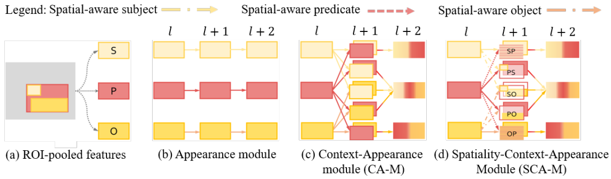
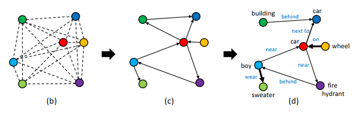
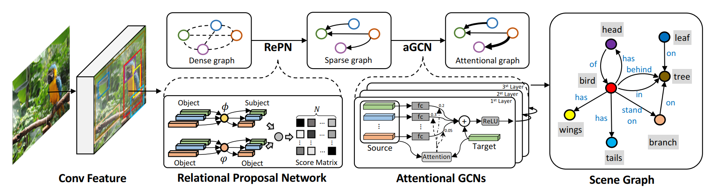
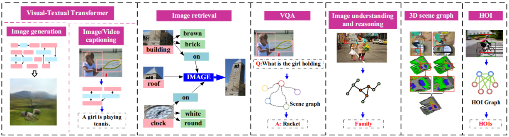

# Scene graphs

Scene graph is a representation of an image or a video that reflects an underlying structure of a scene.

---

# Scene graph example

## This graph:
- Reflects relations between objects
- Can be a source of spatial knowledge
- Should be expressed formally on some human language

---

# Scene graph generation

1. Object detection. On this step primary detection happens. Objects and their bounding boxes are extracted.
2. Object-relation-subject SGG triplets are constructed from primary detected objects.
3. One from the variety of Scene Graph Generation (SGG) algorithms is applied.

---

# 1. Object recognition

On this step one of the existing object detection algorithms is used. By the end of this step we have a detected object and bounding boxes list.

---

# 2. Object-relation-subject triplets generation

The recognized objects are grouped to form a list of <subject, relation, object> triplets.
Those triplets can be filtered to get rid of not important objects or relations.

---

# 3. SGG

This is the final step where Scene Graph Generation happens. This step is fully customizable and we can use whatever algorithm we want, such as message passing networks, CNN, RNN/LSTM etc.

---

---

# Scene graph generation models

There are many different approaches to deal with the initial detected objects such as:

1. Using CNN to derive a relation for object-relation-subject triplets from *visual* appearance.
2. Using RNN/LSTM to to derive a relation from visual features and smoothing it by many steps.
3. Using message passing and GNN to learn relation from primary graph.

However I here we will mostly cover Graph network connected methods.

---

# CNN architecture example

Visual and Language modules are employed to generate the final graph. Mainly this method is based on mapping visual features on graph and language.

---

# RNN/LSTM architecture example

Subject, object and relation features are extracted and dimension are reduced. Then recursive propagation is being applied.

---

# GNN architecture example

Fully-connected graph is constructed, then unnecessary edges are pruned and graph convolution is applied on sparse graph to learn graph contextual features, such as relations from our triplets. 

---

# GNN architecture explained

---

# Applications of Scene graph

The next step is to apply scene graph to benefit from it. Down below are some of the variants listed:

1. Captioning.
2. Generation.
3. Image retrieval.
4. Visual question answering.
5. Image understanding.
6. 3d Scene generation.
7. Human-object-interaction.

---

# Applications of Scene graph

---

# Conclusion

Scene graph extraction can be performed differently, but the main pipeline has been described in this presentation (Page 7).

Scene graph is a compressed representation of given image, which contains a meaningful information about image.

Scene graphs can be used in a wide variety of tasks connected to understanding some image or video.

---

# Afterword

Scene graph generation for image compression (take a look on existing papers)
Application niche and scenario, motivation.

Prepare different application variants and scenarios, how and where exactly we can use it.

Compare scene graph and JPEG sizes.