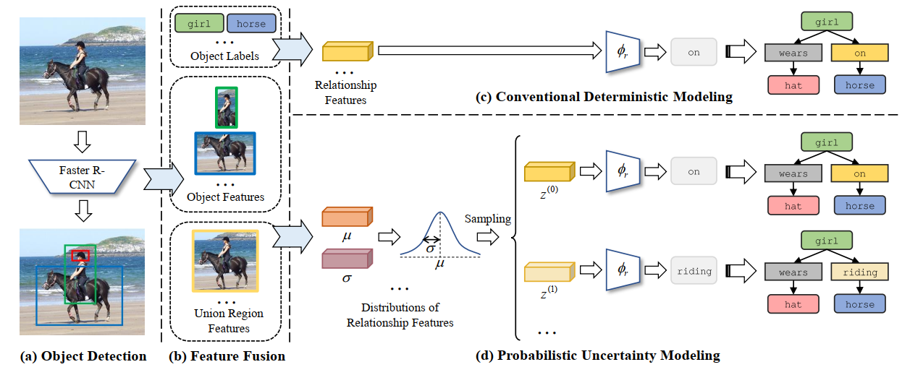

# 1. Bipartite Graph Network with Adaptive Message Passing for Unbiased Scene Graph Generation

In [@Li_Zhang_Wan_He_2021] authors use bipartite graph in their Scene Graph Generation (SGG) algorithm. They threat objects and relations as a different types of nodes in a bipartite graph, so their graph consists of two node types: $V_r$ and $V_o$.

Authors use a Faster R-CNN as a backbone network, which is a quite classic choice. After that relation proposals are generated. Generated proposals are built out from convolutional features from the top of backbone network, its spatial information from bounding box and the meaningfully information about class of detected objects. On this stage two fully-connected networks are used to learn the final projection.

Nextly, after relationship proposals being obtained, bipartite graph (mentioned above) is built. Using another learnable transformation, relationship confidence is calculated based on both objects and relation information.

They employ message passing to capture scene context. Several message passing steps with learnable functions are applied, after which the network captures neighborhood information.

They use both relationship and message passing error in their cost function as well as the relationship proposal and detected objects.

# 2. Probabilistic Modeling of Semantic Ambiguity for Scene Graph Generation

In [@Yang_Zhang_Zhang_Wu_Yang_2021] they consider a problem of uncertainty while predicting relationship label. Exactly one relation can be labeled differently, such as "human holding umbrella" and "human carrying umbrella". This problem is called *semantic ambiguity*.

In this paper authors employ probabilistic certainty for the soak of predicting labels more accurate, and not ot miss some of the predictions. As it's shown on the [@fig:pum].

{#fig:pum}

Instead of message passing they use stochastic regression to obtain relationship label probabilities.

# Reference