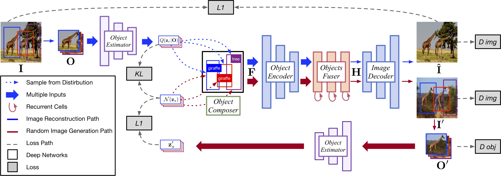

# The problem

Make use of SG while having bounding boxes a-priori.

---

# Layout to image

---

# What do they use a Graph representation for

---

# Semantic image generation using scene graph

---

# Semantic image manipulation using SG

---

# The problem

## SGG pipeline:

1. Object detection (bounding boxes, labels, convolutional features)
2. Scene graph generation (relations)

## Image generation pipeline:

1. SG to layout (bounding boxes)
2. Layout to image (image)

---

# What do I have after object detection

whether the reconstruction using BBs will fail when the BBs overlaps with specific relations (such as "hold")