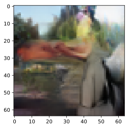
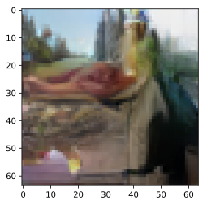
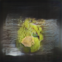

# The problem

Make use of SG while having bounding boxes a-priori.

---

# Layout to image generated images

## Hand holding banana

https://github.com/zhaobozb/layout2im

---

# Scene graph to image

https://github.com/google/sg2im

---

# TODO : 

whether the reconstruction using BBs will fail when the BBs overlaps with specific relations (such as "hold")