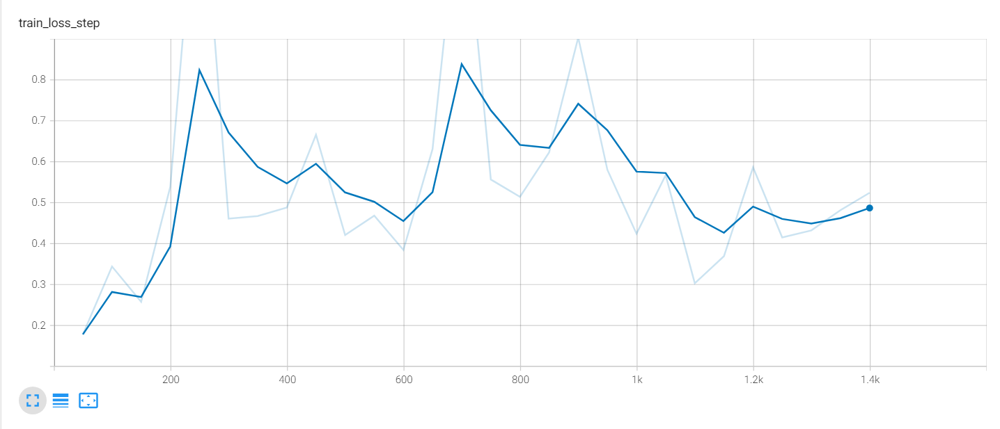
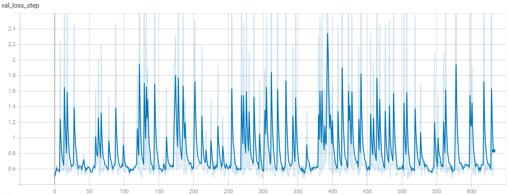

# The problem

While trying to fine-tune FasterRCNN on VisualGenome dataset I am getting an unexpected results.

---

# Train loss

---

# Val loss

---

# Midterm assessment

Midterm Assessment

---
