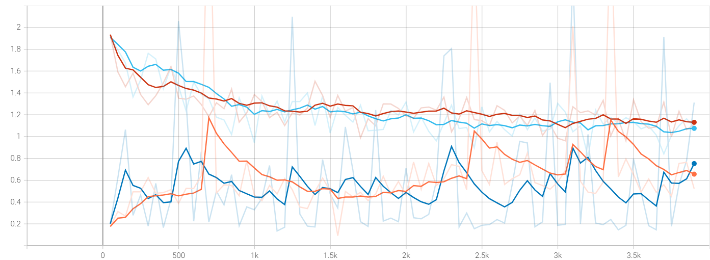

# Summer report
## Nikita 道尔格 LS1906205

---

# The problems I have encountered

 - Building HDF5 datasets to optimize memory usage
 - While trying to fine-tune FasterRCNN on VisualGenome dataset I am getting an unexpected results

---

# Pytorch dataset

Almost finished a best version of Visual Genome dataset for PyTorch.

Currently I use a different one for a couple of reasons:

- Existing `layout to image` is pretrained using a different implementation
- Need a mechanism to convert labels into numeric values and filter out unneeded objects

---

# Training problems

 - I have encountered several problems during training
 - Mainly connected to input data format
 - Cannot overfit

---

# Training loss

---

# Validation loss

---

# Test loss

---

# Mind map

---

# Semester todo

➖ Attend math class (the last one)
➖ Finish the simplest version of the system
➖ Come up with convolutional features architecture
➖ Prepare materials to publish
➖ Midterm assessment
➖ Look for a job in ML related field
➖ Decide on future life strategy
❔ Come back (hopefully)
