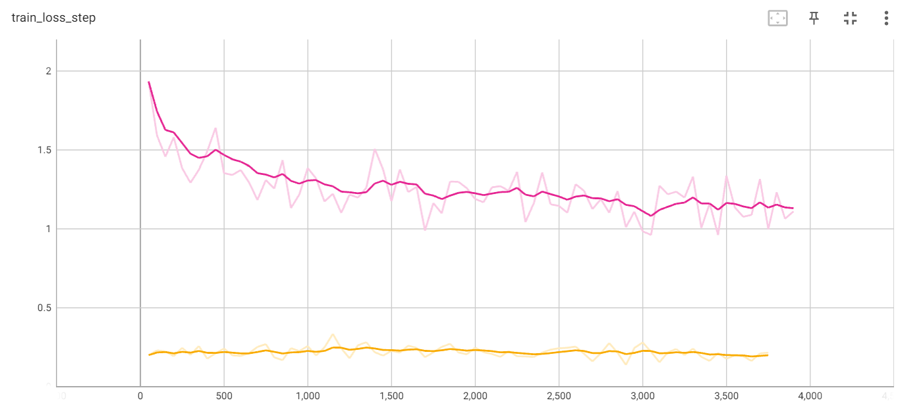

# Weekly report
## Nikita 道尔格 LS1906205

---

# Layout to image

Layout2im is a famous neural network architecture which is used as a starting point in many existing frameworks.

---

# Training stage

They used a bit complex architecture for training. Later only part of this network will be used as an image generator.

---

# Random vectors

Since in their task of image generation they didn't have any information about image identity, so they used random $z$ vectors as seeds. I think that, since I have convolutional features given, I can use them to keep objects identity.

---

# Scene encoding

They first encode random vectors `z` and objects labels and bounding boxes. They used embeddings to encode labels and 

---

# Message fusion

Since we have an arbitrary amount of objects, we need some kind of fusion model in the middle in order to generate some kind of single layout representation.

---

# Image generation

Having one layout representation per image, we can then feed it into generative model, simply deconvolution.

---

# Losses

They trained it using generator and discriminator.

They used several losses:

1. Combination of image and objects discriminator losses.
2. Combination of image and object generator losses

---

# My approach

---

# Training

I faced a problem. The **yellow** line is a **loss dynamic**. It doesn't converge.

