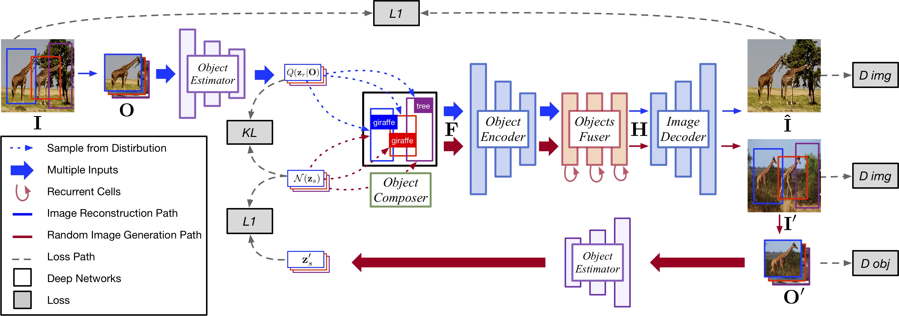

# Weekly report
## Nikita 道尔格 LS1906205

---

# Previous work

 - Layout to image model was chosen as a base for my model
 - I managed to reproduce their results using pretrained model
 - I failed to train their model using their code and hyperparameter values

---

# Detailed model structure

---

# Crop encoder

---

# Layout encoder

---

# Decoder

---

# Loss structure

---

# Separate training pipelines

---

# Adversarial training

