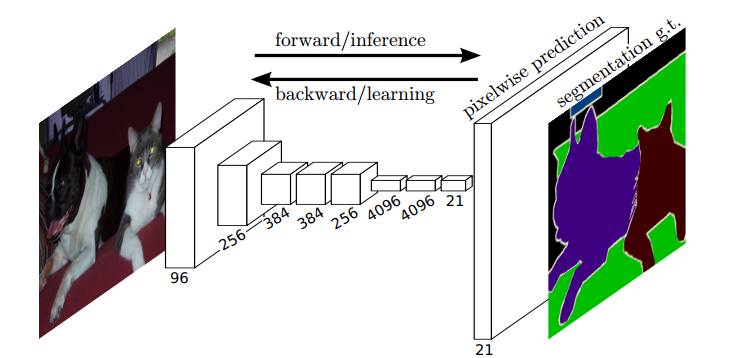
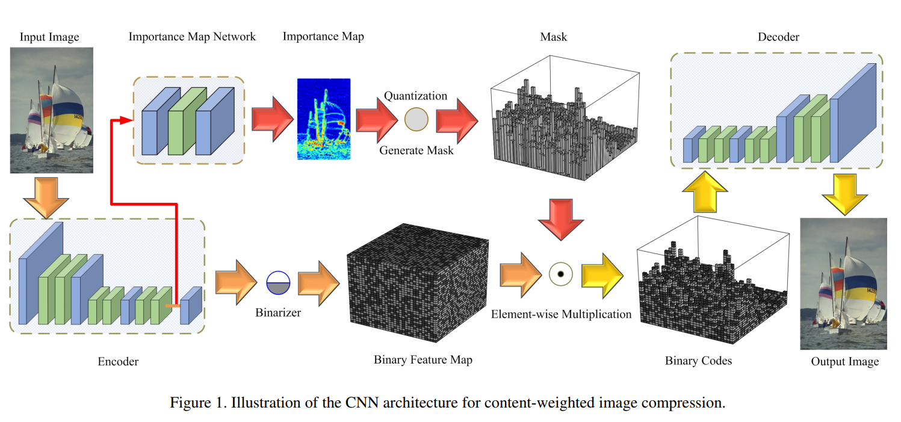
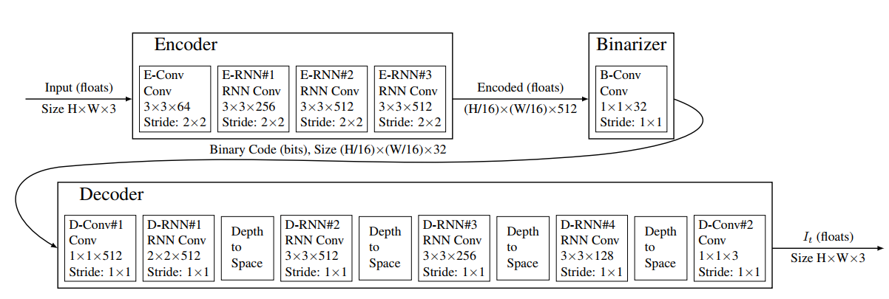
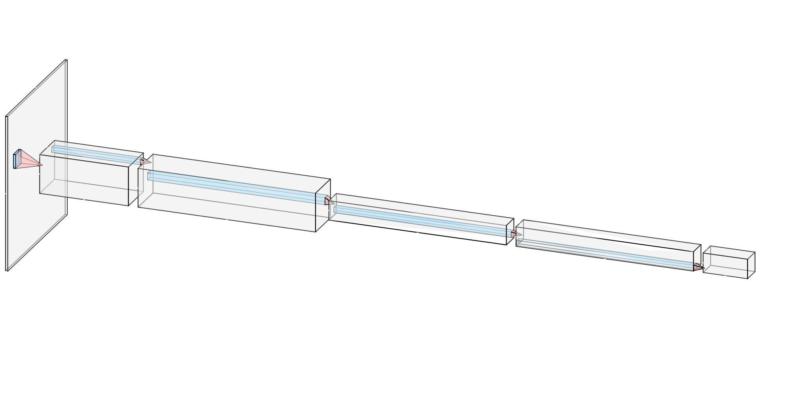
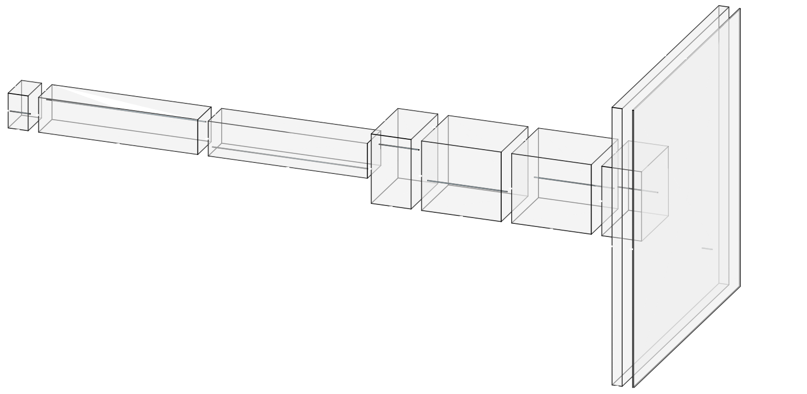
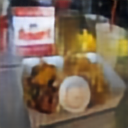

# Weekly report
## Nikita 道尔格 LS1906205

---

# Existing methods

There are existing methods to compress images using convolutional architectures. The main concept here is to remove all the operations that cause a loss of information (usually those are all sorts pooling, interpolation etc.).

---

# Fully Convolutional Networks for Semantic Segmentation

An example of use a fully convolutional networks

---

# Learning Convolutional Networks for Content-weighted Image Compression

Image compression with convolutional networks. Blue blocks are up/down-sampling.

---

# Full Resolution Image Compression with Recurrent Neural Networks

---

# Model I did

I implemented a simple model of encoder/decoder architecture. I used `torch.nn.TransposeConv2d` for upsampling.

---

# Encoder

---

# Decoder

---

# Results

## Original

## Reconstructed

---

# Results (channel size 64)

## Original

## Reconstructed (channel size 32)

---

# Academic activities

