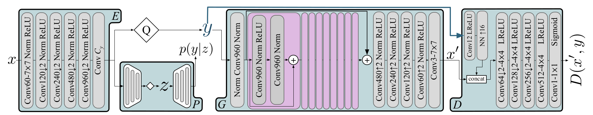
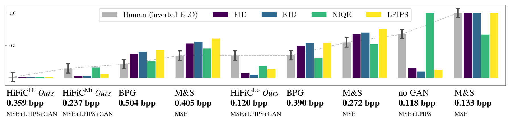
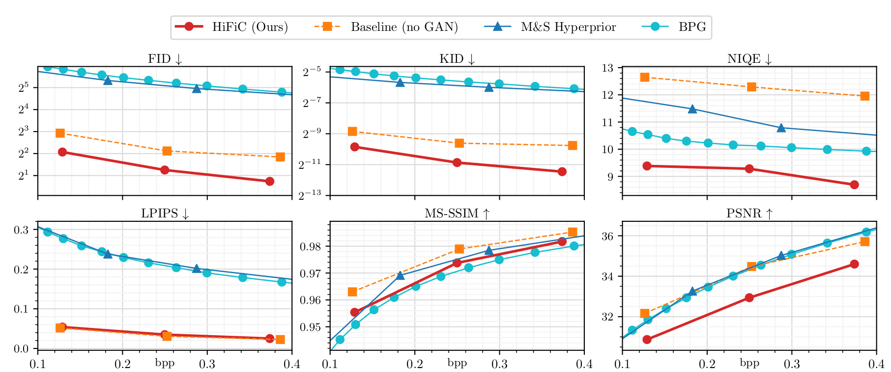
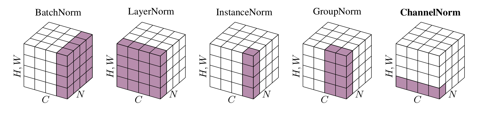

# Weekly report

## Nikita 道尔格 LS1906205

---

# High-fidelity generative image compression

---

## Scores

---

## Curves

---

## Channel normalization

---

## Model details

- There is an implementation avaliable on GitHub
- Results look reliable
- Architecture is not overcomplicated
- Model size is not big (less than 1Gb)

---

## Architecture

Accourding to proposed GAN nature of the model, there are only two **losses**:

1. Adverserial loss
2. Distortion $L2$ loss

### Modules:

1. Encoder
2. Hyperior
3. Decoder
