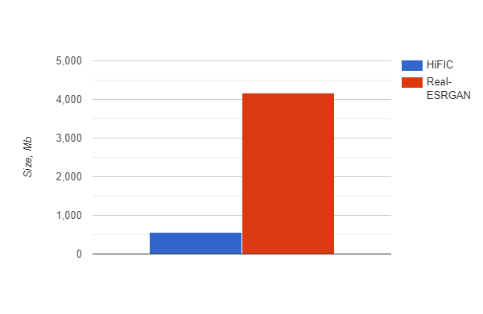

# Weekly report

## Nikita 道尔格 LS1906205

---

# Generator

We are working on generator improvements. Possible improvements are:

1. Reduce size of generator model
2. Improve accuracy of generator

We checked two generator networks (both are GANs) and gathered information about model memory consumption during one pass (with input shape `(1, 3, 128, 128)`).

---

# Compare sizes of model

---

# Remarks regarding convolution

- Conv2D with 2x2 padding that's equivalent to Conv2DTranspose with no padding.
- Checkerboard artifacts can start to become an issue when using strides (even after stacking multiple layers).

---

# Interpolation

To avoid checkerboard artifacts, an alternative upsampling method that’s gaining popularity is to apply classical upsampling followed by a regular convolution (that preserves the spatial dimensions).

---

# Disadvantages

Interpolation is not necessary an optimal way to recover image, but we need to test it.

---

# Training strategy

Since generator model is a part of compression model, and we have a pretrained version of entire model, it is possible to fix encoder and hyperprior parameters and only train generator.
