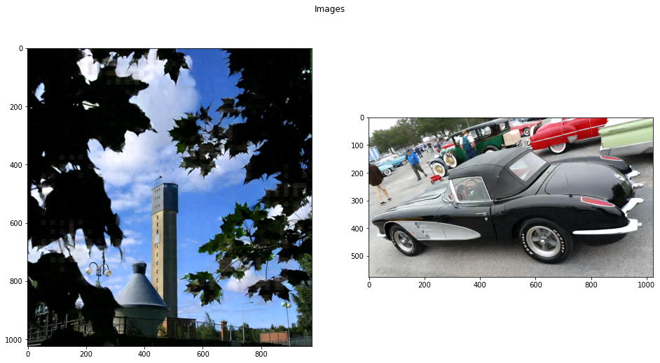
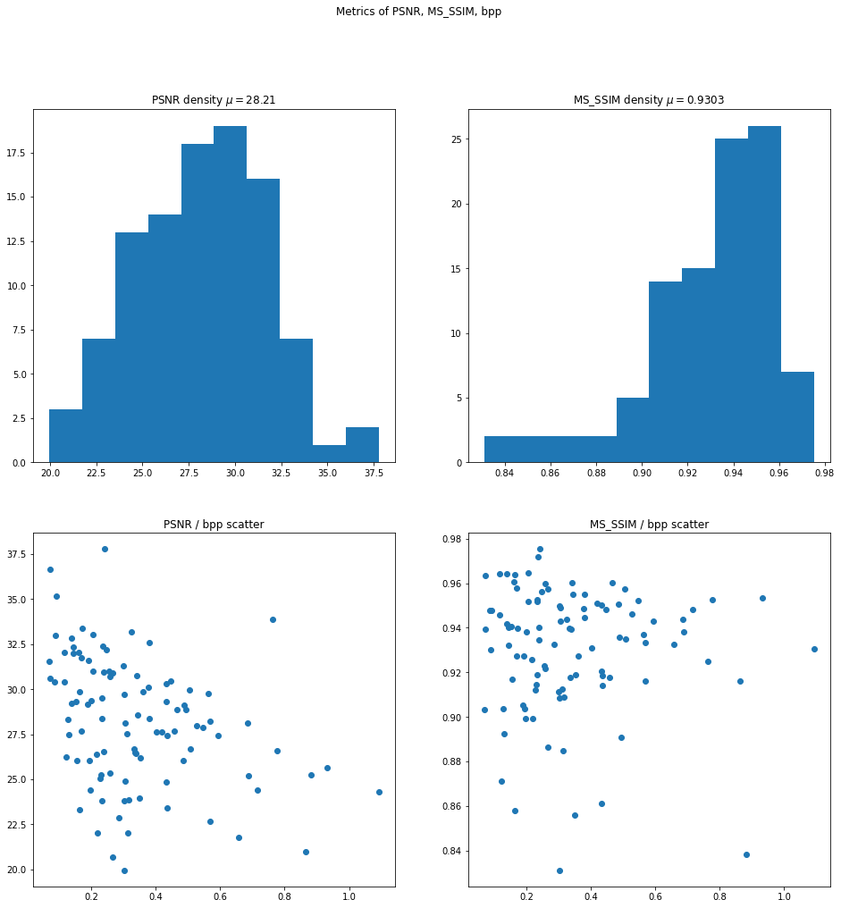
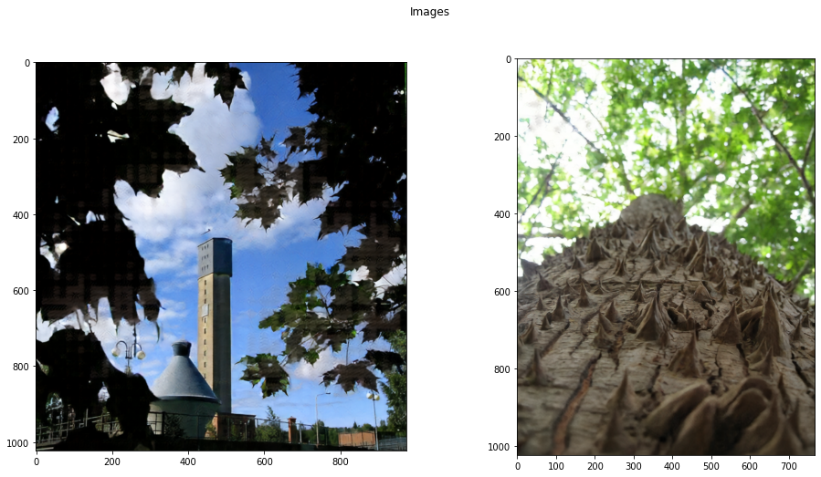
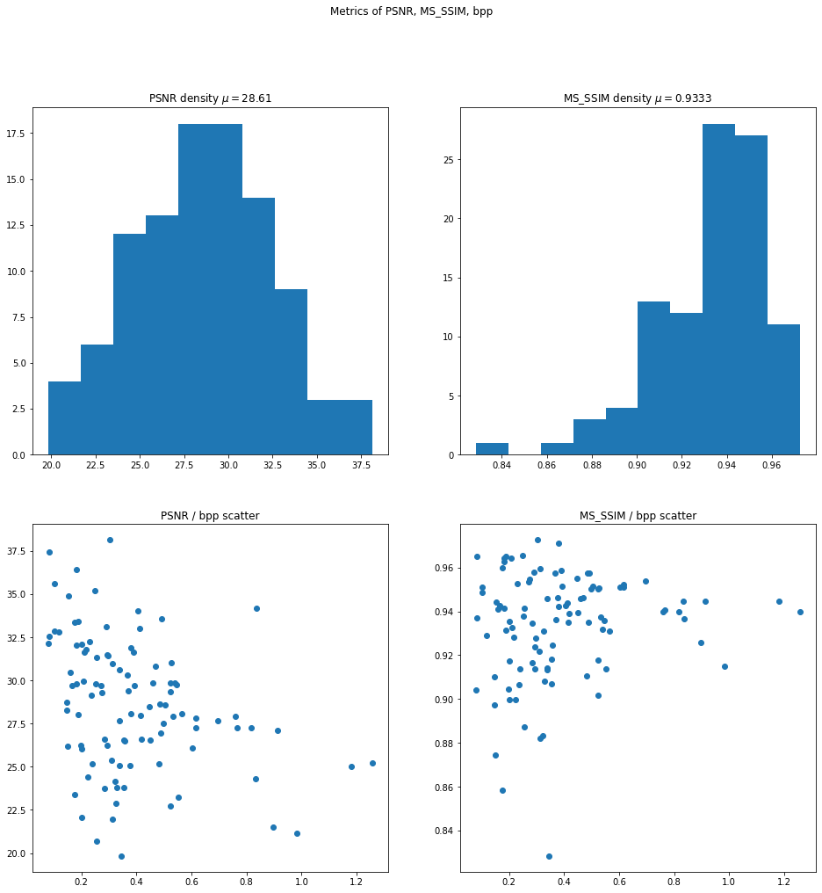
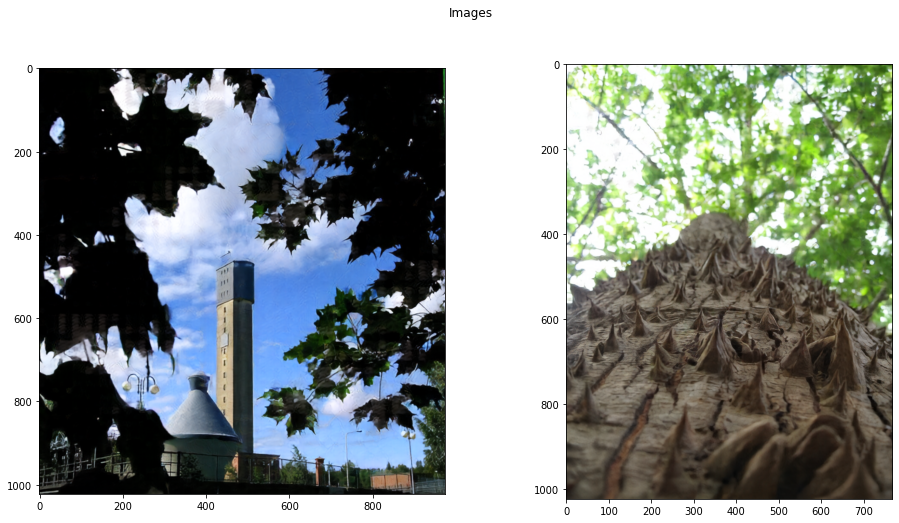
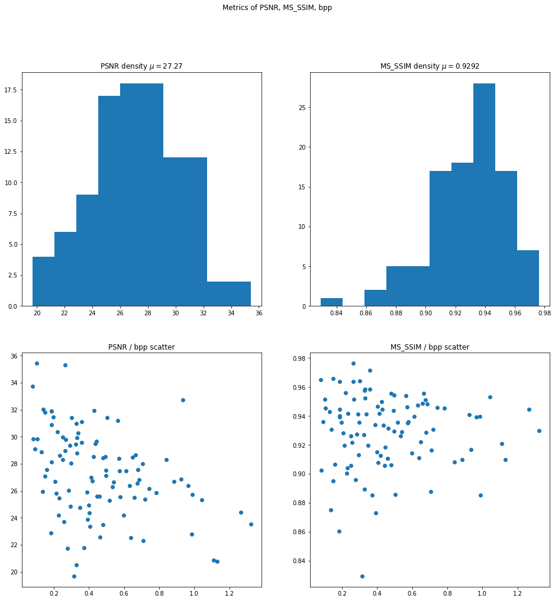
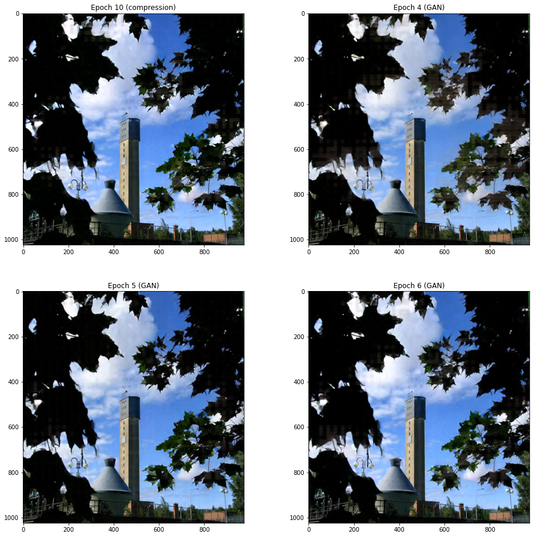
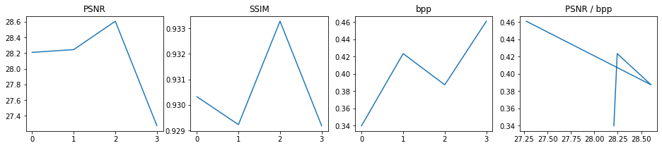

# Weekly report

## Nikita 道尔格 LS1906205

---

# Training

We perform training of our network with different configurations.

We find that 5 residual layers show the highest performance.

---

# Eval

We completed codes for evaluation of a model with several metrics, such as bpp, PSNR and SSIM.

---

# Training details

We use one part of OpenImages dataset (~160,000 images) to train and validate.

One epoch takes ~3h. We loop 10 epochs compression + 7 epochs GAN models.

---

# Evaluation results

Let us move to detailed results analysis.

---

---

---

---

---

---

---

---

---

---

