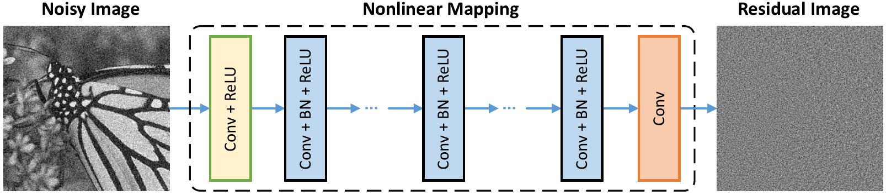
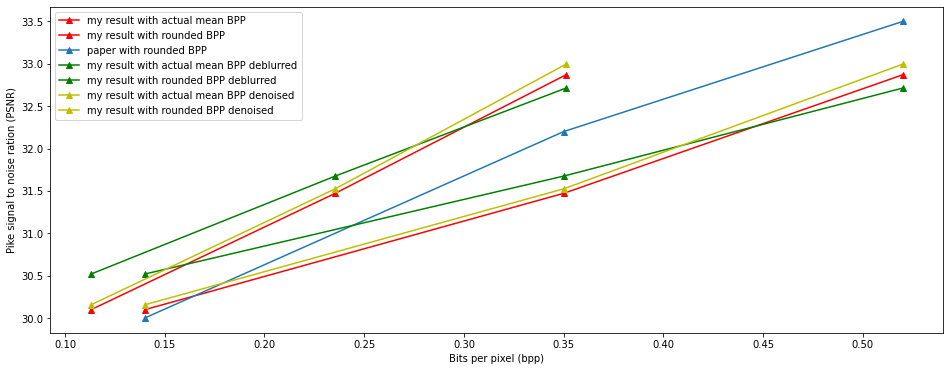

# Weekly report

## Nikita 道尔格 LS1906205

---

# Deblocking network

For deblocking we used ARCNN and L8 networks. These networks didn't show significant performance growth.

---

# DnCNN network

DnCNN is a popular network, which is based on following architecture.

---

# IRCNN network

Denoise network arhitecture is based on following architecture. Here residual connections are used.

---

# Evaluation results

Let us move to detailed results analysis.

We use term "actual mean BPP". We calculate actual mean BPP as an aposteriori BPP mean over entire validation set. Actual BPP in most cases is much lower than the BPP model was trained for.

---

---

# Conclusion

From these experiments we can see that the highest performance growth was acheaved by IRCNN denoise network.
