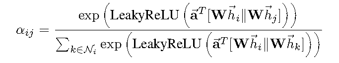

# LS1906205 weekly report

## Abstract
This week I have rad:

1. Geometric deep learning on graphs and manifolds using mixture model CNNs[@Monti2017]
2. A MOTIF-BASED GRAPH CONVOLUTIONAL NETWORK for DIRECTED GRAPHS[@Monti2018]
3. Graph attention networks[@Velickovic2017]
4. Interpretable Graph Capsule Networks for Object Recognition[@Gu2020]

## 1. Geometric deep learning on graphs and manifolds using mixture model CNNs
This paper is a survey on graph convolutions. The paper is quite old but I did like Monti[@Monti2018] paper, so I also rad this.

Some content from there, but nothing new, just old versions of things which are already well-known:

Where $\sum$ and $\mu$ are learnable.

## 2. MOTIFNET: A MOTIF-BASED GRAPH CONVOLUTIONAL NETWORK FOR DIRECTED GRAPHS
The main idea of this paper is "motif" term. Authors define a *motif* (Figure 3) as a small subgraph which represents a specific structure. In the paper they consider a three nodes fully-connected motif graphs.

These motifs can be interpreted as a patches, which can determine a certain local structure.

Then once we have adjacency matrixes for each motif, we can calculate its Laplacian. Afterwards applying following formula (Figure 5.A, Figure 5.B) we get intermediate representation, which can be convolved (Figure 6)

## 3. Graph attention networks (GAT)
This paper is quite popular, authors purpose attention mechanism, which can be simply thought as an additional learnable parameter.

Attection can be calculated using following formula:

Where W are learnable parameters.

Here the only new idea is to put an attention mechanism. There are different ways of applying attention:

- Use multiple attentions per edge. This is called multihead attention.
- Attention weights can be either concatenated or averaged.

I implemented a very naive one-head attention (Figure 9)

So, attention is a method to weight an edge accourding to its importance to node.

## 4. Interpretable Graph Capsule Networks for Object Recognition
This paper purpose a way of applying GCN in object recognition.

Paper is mainly about computer vision. They use term *capsule* to describe some region of image (for example face features like eyes or nose), which is important for recognition of an object.

The algorithm goes as follows:

1. Extract *primary capsules* from image
2. Transform capsules to intermediate state
3. Do an attenction based graph pooling (attention mechanism from GAT[@Velickovic2017])
4. Then we got output capsules

The design of the network can be seen on Figure 10.

Overall article is quite interesting but I didn't take a look at CapNets architecture, so for now it's kind of black box for me.

## References