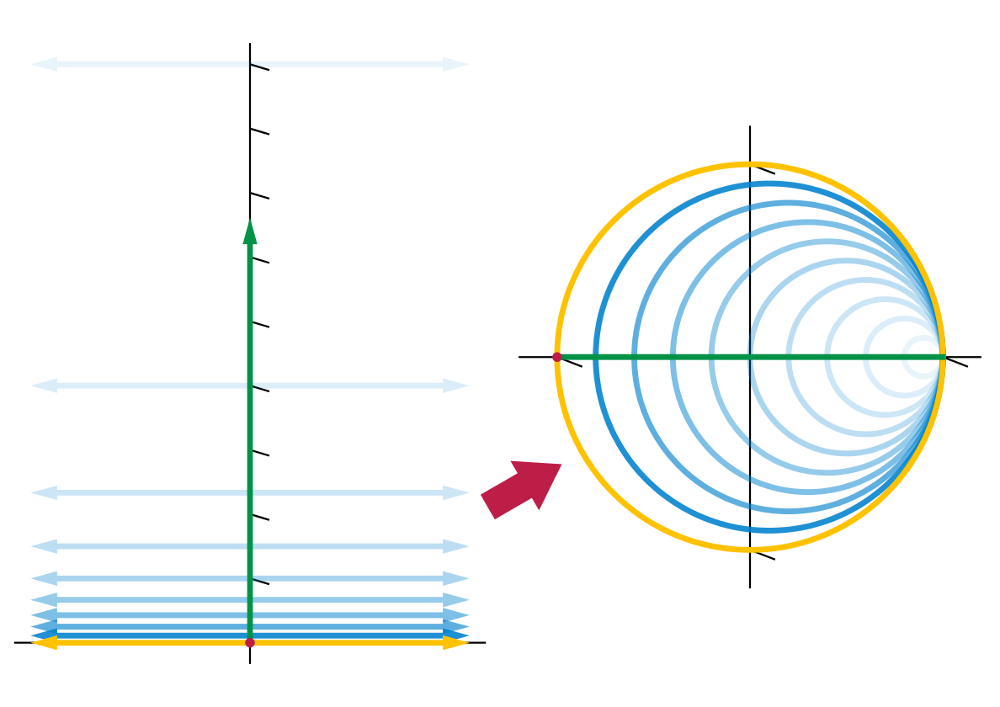
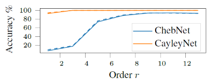
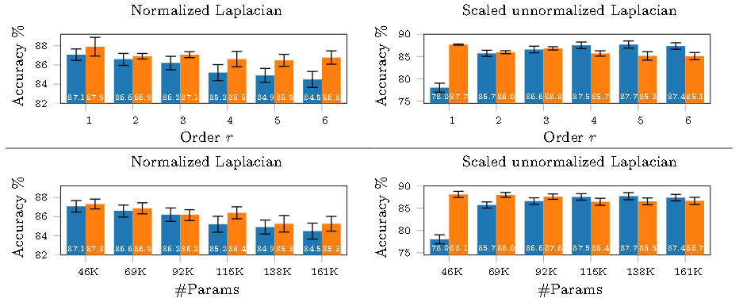

# 1. Attention is all you need

This paper [@Vaswani2017] is a milestone in NLP. I've picked it just to have a clear explanation of Transformer architecture, which is used in the 2-nd chapter of this report. In this article the new architecture called Transformer shows a high performance growth comparing to previous approaches. Implementation can be seen here [@AlexanderRush]

# 2. A generalization of Transformer Networks to Graphs

In this paper [@Dwivedi2020] authors apply a Transformer architecture on graph.

# 3. Inductive representation Learning on Large Graphs

In this paper [@Hamilton2017] they purpose in some sense improved version of graph convolution. This is a spacial approach.

# 4. Relational inductive biases, deep learning, and graph networks

This is a conceptual paper[@Battaglia2018] about learning ability on graphs.

# 5. Inductive representation learning on large graphs

This paper purposes a method to learn on large graphs and predict unseen elements.

# 6. Learning aligned-spacial graph convolutional networks for graph classification

# 7. Simple and deep graph convolutional networks

# 8. CayleyNets. Graph convolutional neural networks with complex rational spectral filters

In this paper[@Levie2019] authors purpose using Cayley filters as a convolutional kernel. They claim that even first order Cayley polynomials.
They define a *Cayley polynomial* as [@eq:polynomial]

$$
g_{c,h}(\lambda)=c_0+2Re\{\sum_{j=1}^{r}c_j(h\lambda-1)^j(h\lambda+1)^{-j}\}
$${#eq:polynomial}

Where

- $Re(z)$ returns real part of complex $z$
- $c, h$ - learnable parameters
- $(h\lambda-1)(h\lambda+1){-1}$ is Cayley transform $f(z)=\dfrac{(z-1)}{(z+1)}$

So, what this convolution basically does is maps from a complex plane inside a circle. It can be imagined as wrapping a plane space into a circle [@fig:cayley_transform].

{#fig:cayley_transform}

Then convolution can be defined as [@eq:convolution]

$$
Gf=g_{c,h}(\Delta)f=c_0f+2Re\{\sum_{j=1}^{r}c_j(h\Delta-1)^j(h\Delta+1)^{-j}f\}
$${#eq:convolution}

Where

 - $\Delta$ is a Laplacian of a graph
 - $f$ is a vector of signals $v\times c$ and $v,c$ are number of nodes and number of features respectively
 - $c, h$ are learnable

Authors claim that the main advantages of considered architecture are:

1. No need to compute eigen-decomposition of graph Laplacian (Since they are using Laplacian in the kernel). This makes the algorithm much faster.
2. Filters are localized in the spacial domain.
3. Since Cayley transform maps a real numbers on a line of circle (shown yellow [@fig:cayley_transform]), then $C^j(h\Delta)$ from [@eq:laurent] can be thought as a multiplication by a pure harmonic in the frequency domain [@eq:laurent_filter].
  $$
    G=c_0I+\sum_{j=1}^{r}c_jC^j(h\Delta)+\bar{c_j}C^{-j}(h\Delta)
  $${#eq:laurent}

  $$
    C^j(h\Delta)=\Phi diag([C(h\lambda_1)]^j,...,[C(h\lambda)_n]^j)\Phi^T
  $${#eq:laurent_filter}

The results are quite promising: An order of polynomial seems to correlate with an accuracy more stable then Chebyshev polynomials [@fig:accuracy;@fig:results].

{#fig:accuracy}

{#fig:results}

# References