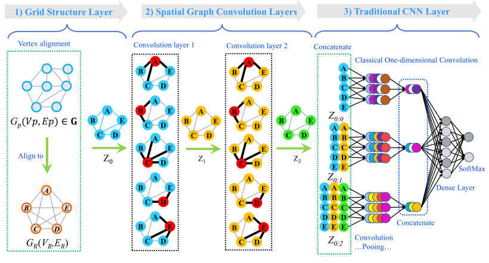

# 1. Attention is all you need

This paper [@Vaswani2017] is a milestone in NLP. I've picked it just to have a clear explanation of Transformer architecture, which is used in the 2-nd chapter of this report. In this article the new architecture called Transformer shows a high performance growth comparing to previous approaches. Implementation can be seen here [@AlexanderRush].

Authors purpose a novel architecture [@fig:attention_architecture].

{#fig:attention_architecture}

Data flow is quite simple. This architecture follows encoder-decoder logic, so first features are passed through positional encoding, then multi-head attention is applied. As an output of encoder we got an encoded vector of intermediate representation. Then it can be decoded through recursive decoder (it considers both previous state passed through masked attention and intermediate representations). Encoder can be parallelized.

Calculations are described on [@fig:attention_is_all_you_need].

{#fig:attention_is_all_you_need}

# 2. A generalization of Transformer Networks to Graphs

In this paper [@Dwivedi2020] authors apply a Transformer architecture on graph.

It's quite obvious that transformer architecture can be generalized to graph. Moreover, transformer architecture seems to be a very neat and easy to apply on structured data.

Author purpose a following scheme:

1. Use graph Laplacian eigenvectors in positional encoding.
2. Similar to NLP transformer features then are cloned into queries and keys.
3. Multi-head attention is being applied.
4. Concatenation, normalization and MLP is being applied.
5. Output is next layer features.

{#fig:graph_transformer}

Linear transformation applied on node and edge features:
$$
\hat{h_i^0}=A^0\alpha_i + a^0 ; e_{ij}^0=B^0\beta_{ij}+b^0
$${#eq:graph_transformer_feature_encoding}

Position encoding (using eigenvectors).
$$
\lambda^0_i=C^0\lambda_i+c^0 ; h^0_i=\hat{h}^0_i+\lambda^0_i
$${#eq:graph_transformer_position_encoding}

Finally node update rule.
$$
\hat{h}_i^{l+1}=O_h^lconcat_{k=1}^H(\sum_{j\in{N}}w^{k,l}_{ij}V^{k,l}h^l_j)
$${#eq:graph_transformer_update}

Where
$$
w^{k,l}_{ij}=softmax_j(\dfrac{Q^ {k,l}h^l_i*K^{k,l}h^l_j}{\sqrt{d_k}})
$${#eq:graph_transformer_weight}

In the end, looking at the results [@fig:transformer_results] we can see that Laplacian positional encoding shows highest performance. However, overall performance is not really high. So, I think that even though a Graph Transformer networks are interesting, they still are not showing an outstanding performance (comparing to GAT for example).

{#fig:transformer_results}

# 3. Inductive representation Learning on Large Graphs

In this paper [@Hamilton2017] they purpose in some sense improved version of graph convolution. This is a spacial approach.

New algorithm was called GraphSAGE. This is a slightly modified version of spacial convolution. Main contribution is an idea to use $N(v)$ function for *sampling* neighbors. This function basically takes up to $\gamma$ neighbors of a node instead of taking into account all existing neighboring nodes.

Aggregator with such setting is determined by [@eq:GraphSAGE_aggregator]. Here max pooling is being used.

$$
AGGREGATE^{pool}_k=max({\sigma(W_{pool}h^k_{u_i}+b), \forall_{u_i}\in N(v)})
$${#eq:GraphSAGE_aggregator}

In fact we learn function of neighbors instead of calculating a whole graph embeddings, what allows us to apply same learned function on a new completely unseen nodes.

# 4. Learning aligned-spacial graph convolutional networks for graph classification

In [@Bai2019] they purpose to transform an arbitrary sized graphs into fixed-sized aligned grid structures, then being able to perform convolution [@fig:asgcn].

{#fig:asgcn}

Convolution is not unique, so I will focus more on an aligning process [@fig:align].

{#fig:align}

In short, aligning process is just a process of assigning corresponding vertexes of aligning graph to prepared grid. We have a grid, then for each vertex of current graph we align it best match from grid vertex set.

In general their performance is just average, nothing special, interesting is just their attempt to somehow align the graph to some grid.

Again, results are understandable. We ignore spacial properties of a graph by using only features. Edges and spectrum are ignored in process of aligning.

# 5. Simple and deep graph convolutional networks

In this paper [@Chen2020] authors consider a problem of over-smoothing in case of stacking several layers of GCN. They solve this problem adding a residual connection [@eq:gcnii]

$$
H^{l+1}=\sigma(((1-\alpha_l)\hat{P}H^{(l)}+\alpha_lH^{(0)})((1-\beta_l)I_n+\beta_lW^{(l)}))
$${#eq:gcnii}

Where
$$
\hat{P}=\tilde{D}^{-1/2}\tilde{A}\tilde{D}^{-1/2}
$${#eq:gcnii_convolution_matrix}

they claim that this residual connection keeps results of each convolutional layer closer to initial features, which helps to avoid gradient vanishing problem.

Their results [@fig:gcnii_results;@fig:gcnii]:

{#fig:gcnii_results}

{#fig:gcnii}

So, we can see that in case of deep architecture their model is stable, however we can also see that it is not really necessary to build a deep network because even 2-layer network shows high performance (comparable to their deep architecture).

# 6. CayleyNets. Graph convolutional neural networks with complex rational spectral filters

In this paper[@Levie2019] authors purpose using Cayley filters as a convolutional kernel. They claim that even first order Cayley polynomials are more effective then Chebyshev polynomials of higher order.
They define a *Cayley polynomial* as [@eq:polynomial]

$$
g_{c,h}(\lambda)=c_0+2Re\{\sum_{j=1}^{r}c_j(h\lambda-1)^j(h\lambda+1)^{-j}\}
$${#eq:polynomial}

Where

- $Re(z)$ returns real part of complex $z$
- $c, h$ - learnable parameters
- $(h\lambda-1)(h\lambda+1){-1}$ is Cayley transform $f(z)=\dfrac{(z-1)}{(z+1)}$

So, what this convolution basically does is maps from a complex plane inside a circle. It can be imagined as wrapping a plane space into a circle [@fig:cayley_transform].

{#fig:cayley_transform}

Then convolution can be defined as [@eq:convolution]

$$
Gf=g_{c,h}(\Delta)f=c_0f+2Re\{\sum_{j=1}^{r}c_j(h\Delta-1)^j(h\Delta+1)^{-j}f\}
$${#eq:convolution}

Where

 - $\Delta$ is a Laplacian of a graph
 - $f$ is a vector of signals $v\times c$ and $v,c$ are number of nodes and number of features respectively
 - $c, h$ are learnable

Authors claim that the main advantages of considered architecture are:

1. No need to compute eigen-decomposition of graph Laplacian (Since they are using Laplacian in the kernel). This makes the algorithm much faster.
2. Filters are localized in the spacial domain.
3. Since Cayley transform maps a real numbers on a line of circle (shown yellow [@fig:cayley_transform]), then $C^j(h\Delta)$ from [@eq:laurent] can be thought as a multiplication by a pure harmonic in the frequency domain [@eq:laurent_filter].
  $$
    G=c_0I+\sum_{j=1}^{r}c_jC^j(h\Delta)+\bar{c_j}C^{-j}(h\Delta)
  $${#eq:laurent}

  $$
    C^j(h\Delta)=\Phi diag([C(h\lambda_1)]^j,...,[C(h\lambda)_n]^j)\Phi^T
  $${#eq:laurent_filter}

The results are quite promising: An order of polynomial seems to correlate with an accuracy more stable then Chebyshev polynomials [@fig:accuracy;@fig:results].

{#fig:accuracy}

{#fig:results}

# References