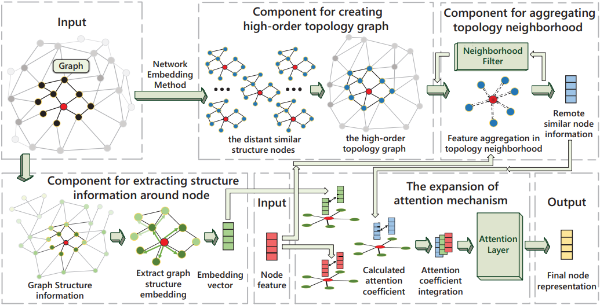
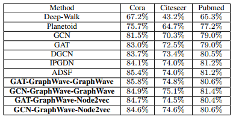
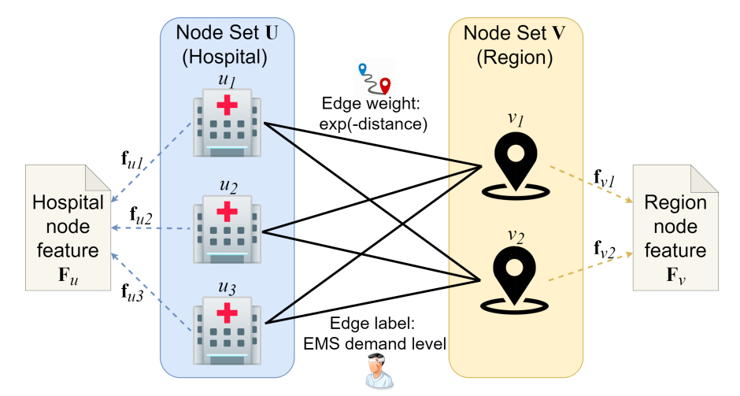
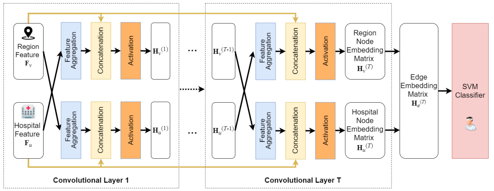
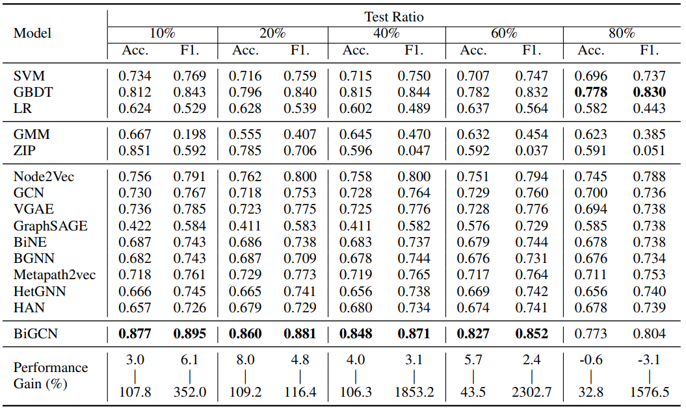
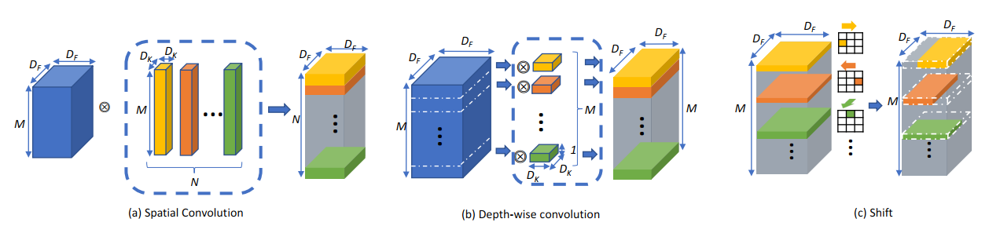
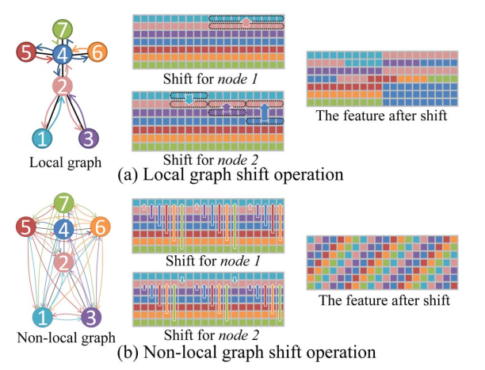
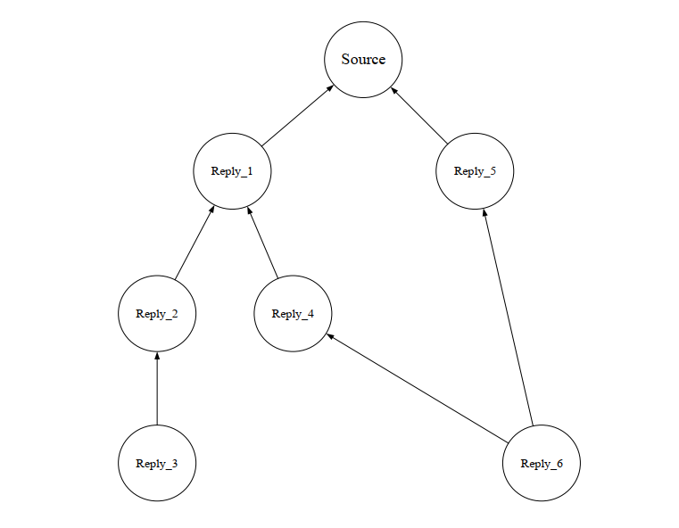

# Literature review

Currently graph neural nets are able to take into account only k-hop neighbors. But it's clear that this approach can be quite unfair. In [@wang_atpgnn_2021] authors built such an architecture that it can consider both local k-hop neighbors structure and distant nodes that are located in similar topological context. What do they do is basically perform three independent and completely different embedding procedures (discussed below) and then make a decision based on the embeddings results.

The vast majority of works in the sphere is about some general type of graphs. However there are some works [@jin_predicting_2021] about bipartite graphs. Bipartite graph is just a graph that has two node sets. Nodes can be different types, then we also call it heterogeneous. In considered paper authors apply graph learning algorithm on Tokyo emergency infrastructure data. They separate the data on two types regions and hospitals each has its own features, then do a binary classification to predict whether the system can handle a difficult situation and what are the weakest elements.

In computer vision there is a problem in field of action recognition. Action recognition can be seen as a problem of graph classification [@cheng_skeleton-based_2020]. We represent objects as a graphs and construct a representations for nodes. Then having both node features and connection information we can apply graph convolution in kind of special way.

# 1. ATPGNN: Reconstruction of Neighborhood in Graph Neural Networks With Attention-Based Topological Patterns

First let me show their architecture [@fig:atpgnn_architecture]. Knowing general idea it would be easier to explain all the deep concepts.

{#fig:atpgnn_architecture}

Let me start from the output of the algorithm then going to the input. There is an attention layer, similar to GAT [@Velickovic2017], but having three different attention mechanism. The first is feature attention [@eq:atpgnn_feature_attention]. Feature attention doesn't differ from GAT really much.

$$
e^l_{i,j}=\delta([W^l\vec{h}^l_i||W^l\vec{h}^l_j]),v_j\in N_i
$${#eq:atpgnn_feature_attention}

Where $\vec{h}^0_i=\vec{x}^T_i$ and $\vec{h}^0_j=\vec{x}^T_j$.

Next is topology attention [@eq:atpgnn_topology_attention], which contains information about remote similar nodes information.

$$
f^l_{i,j}=\delta([W^{l}\vec{p}^l_i||W^l\vec{p}^l_j]),v_i\in N_i
$${#eq:atpgnn_topology_attention}

Where $\vec{p}^0_i=\vec{s}^T_i$ is a representation of remote node with similar structure, obtained by independently performed message passing.

Let me explain this message passing meaning. We do it to obtain structural information of node local neighborhood, and then it's easy to find nodes with similar representation. In case of linear data structure (here we have just node embedding list) it's a trivial task.

The final formula of convolution is [@eq:atpgnn_convolution]

$$
\vec{h}^l_i=concatenate^K_{k=1}(\sigma(\sum_{v_j\in N_i}A^{k(l-1)}_{i,j}W^{k(l-1)}\vec{h}^{l-1}_j))
$${@eq:atpgnn_convolution}

Here $A$ is graph representation obtained by combining previously mentioned attentions.

Generally speaking concatenation is used in case when we need to separate some groups of features from each other.

Architecture is quite interesting. They combine several architecture to obtain something new. The results [@fig:atpgnn_results], however, are just a little better then plain GCN.

{#fig:atpgnn_results}

We can see that they perform slightly better then just plain architecture. I think in some domains this architecture is applicable and can be used as an example of complex GNN architecture.

# 2. Predicting Emergency Medical Service Demand with Bipartite Graph Convolutional Networks

Let me start by defining a problem. They have a database containing a statistics on Tokyo emergency data. Each hospital can give an information about past emergency cases. Some data on patients age, gender ambulance type, date, hospital address etc. and some hospital characteristics like capacity. Each region aso has similar data on injury cases, injured citizens data etc.

They build a bipartite graph [@fig:bigcn_graph] based on data mentioned above.

{#fig:bigcn_graph}

It is clear that applying a GNN or GNN we won't get any adequate results. Graph structure is too specific [@eq:bigcn_adjacency_matrix_structure].

$$
A=\begin{bmatrix}
  0_{M\times M} & B_u \\
  B_v & 0_{N\times N}\\
\end{bmatrix}
$${#eq:bigcn_adjacency_matrix_structure}

Where $B_u$ and $B_v$ are adjacency matrixes for hospital nodes $u\in U$ and for regions $v\in V$ and other elements are zeros because we know the graph is bipartite (node from $U$ can only be connected to node from $V$ and opposite).

So, we can also think of feature matrix as shown in [@eq:bigcn_feature_matrix].

$$
H^{(0)}=\begin{bmatrix}
  F_u & | & 0_{M\times(Q-P)} \\
   & & F_u \\ 
\end{bmatrix}
$${#eq:bigcn_feature_matrix}

Where $F_u$ and $F_v$ are features are corresponding initial features of $U$ and $V$ nodes subsets. $M$, $Q$ and $P$ are number of hospital nodes, number of region features, number of hospital features.

{#fig:bigcn_architecture}

Purposed architecture is shown on [@fig:bigcn_architecture]. Here we can see that there are two flows, for each part of bipartite graph. 

And finlay all we need now is just to set up a propagation rule which is in [@eq:bigcn_propagation_rule]. Here I put only rule for half of the network (remind we have a bipartite graph with two types of nodes, so propagation is implementing in two flows running in parallel). A formula for $V$ flow is down here.

$$
H^{(t+1)}_v=\sigma([D^{-1}_vB_vH^{(t)}_vW^{(t+1)_v}||F_v\omega^{(t+1)}_v])
$${#eq:bigcn_propagation rule}

Where $D^{-1}$ is diagonal degree matrix and $\omega$ is another filter matrix.

Afterwards they apply SVM classifier on the final embedding set.

{#fig:bigcn_results}

Results ([@fig:bigcn_results]) are surprisingly good. They acheaved in some runs more then 85% accuracy for their database.

# 3. Skeleton-Based Action Recognition with Shift Graph Convolutional Network

Given a video mapped skeleton data we want to classify skeleton movement. In this task we again face a problem of locality. For example, classify "clap" we need to know about state of some distant nodes, but some other distant nodes are not as important. So, in case of "clap" we might be interested in states of left and right palms, but less interested in other body parts state. GNN wont work well in this case due to it's k-hop neighbors locality limitation.

Authors purpose a method with the main idea borrowed from CNN's field, which is called Shift convolution [@wu_shift_2017]. In CNN shift is a special kind of channel-wise convolution [@fig:shift_cnn], but with, in some sense, special filters. Each filter contains only one non-zero element, so it can be implemented in more efficient way.

{#fig:shift_cnn}

Authors purpose to adopt this shift operator to graph domain following way. Let's define a shift by swapping neighboring nodes features [@shift_gcn].

{#fig:shift_gcn}

It can be formalized in the following way [@eq:shift_gcn].

$$
\tilde{F}_v=F_{(v,:c)}||F_{(B^1_v,c:2c)}|| ... ||F_{(B^n_v,nc:)}
$${#eq:shift_gcn}

Where $B_v=\{B^1_v, B^2_v,...,B^n_v\}$ is a set of neighbors for node $v$ and $c=\lfloor \dfrac{c}{n+1} \rfloor$.

They then use this shift operator in convolution [@eq:shift_convolution].

$$
\tilde{F}_{(v,t,i)}=(1-\lambda)\cdot{F_{(v,\lfloor{t+S_i}\rfloor,i)}}+\lambda\cdot{F_{(v,\lfloor{t+S_i}\rfloor+1,i)}}
$${#eq:shift_convolution}

Where shift $S$ is learnable and $\lambda=S_i-\lfloor S_i \rfloor$.

# 4. Rumour Detection based on Graph Convolutional Neural Net

There is a field in NLP where they try to detect rumors in dome domain (Twitter, Reddit etc.). Considering Twitter each tweet can be treated as a node in some Source-Reply (SR) graph [@fig:rumor_sr_graph], which has one root node and many reply nodes, Reply node has source node and it can also have reply nodes. So this is how they built their graphs.

{#fig:rumor_sr_graph}

They claim that structure of SR graph need to be considered in final decision. So they purpose following architecture [@fig:rumor_architecture].

{#fig:rumor_architecture}

I will not put any formulas here just because they are quite trivial. They use spacial graph convolution and Text CNN, then they mix those two results according to the following mechanism [@eq:rumor_mix].

$$
y=PG\times{\dfrac{M}{N}}+PT\times{(1-\dfrac{N}{M})}
$${#eq:rumor_mix}

Where $PG$ and $PT$ are GCN and CNN outputs, $N$ and $M$ are number of nodes in current graph and number of nodes in the biggest graph.

# Reference 