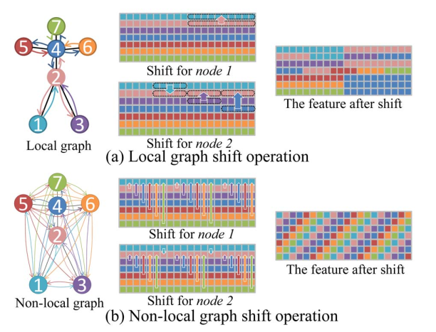

# Skeleton-Based action recognition

Action recognition with skeleton data and Shift-GCN.

---

# Table of content

1. Problem definition and review
2. Spatial Shift-GCN
3. Temporal Shift-GCN
4. Spatio-temporal Shift-GCN
5. Experiments and results
6. Conclusion

---

# 1. Problem definition and review

## Problem definition

- Given a sequence of frames
- Each frame has a set of joints (coordinates)
- The task is to recognize actions within given sequence

---

# 1. Problem definition and review

## Existing approaches

Earlier methods stacked joints into sequence of coordinates or into pseudo-image, then feed it to NN.

*Problem: no spatial relations take into account*.

---

# 1. Problem definition and review

## GCN approaches

Recently ST-GCN, graph convolution model, has been purposed. Model employs spatial and temporal graph convolution.

*Problem: computational complexity is to high; receptive field of purposed models is limited*

---

# 1. Problem definition and review

## Approach

They purpose two convolution:
1. Spatial convolution. It is applied within one frame.
2. Temporal convolution. It is applied within a sequence of frames.

---

# 1. Problem definition and review

## GCN-based action recognition

Within one frame split skeleton on:

1. Center group $\in P$
2. The node itself $\in P$
3. Other from center group $\in P$

Convolution:

$$
F'=\sum_{p\in P}{\bar{A}_pFW_p}
$$

For temporal graph,  regular 1D convolution on the temporal dimension.

---

# 1. Problem definition and review

## Shift CNN

$$
F\in \R^{D_F\times D_F\times C}, K\in \R^{D_K\times D_K\times C\times C'}
$$

FLOPs of regular convolution: $D_K^2\times D_F^2\times C\times C'$

FLOPs of Shift convolution: $D_F^2\times C\times C'$

---

# 1. Problem definition and review

## Shift CNN

---

# 2. Spatial Shift GC

---

# 2. Spatial Shift GC

## 2.1. Local shift operation

Swap features with neighboring nodes.

---

# 2. Spatial Shift GC

## 2.2. Non-local shift operation

All nodes are connected, then swap features of all nodes.

---

# 3. Temporal Shift GC

## Naive temporal GC

Shift graph nodes channels but along temporal dimension.

---

# 3. Temporal Shift GC

## Adaptive temporal GC

Given a sequence of frames:

$$
F\in \R ^{N\times T\times C}
$$

Every channel has a learnable shift parameter:

$$
S_i, i=1,2,...,C
$$

Non-integer shift can be computed by linear interpolation:
$$
\tilde{F}_{(v,t,i)}=(1-\lambda)F_{(v, \lfloor t+S_i\rfloor,i)}+\lambda F_{(v,\lfloor t+S_i\rfloor+1,i)}
$$
Where $\lambda=S_i-\lfloor S_i\rfloor$

---

# 4. Spatio-temporal shift GCN

## Spatio-temporal GC

---

# 5. Experiments and results

## Shift convolution results

---

# 6. Conclusion

 - Interesting approach
 - The architecture is still quite raw
 - Shift works somehow
