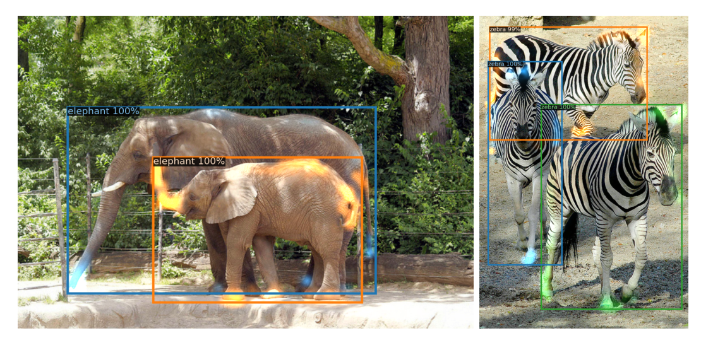
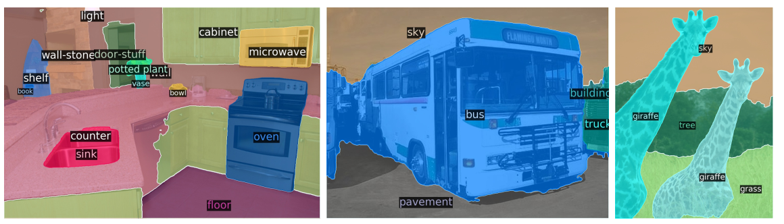
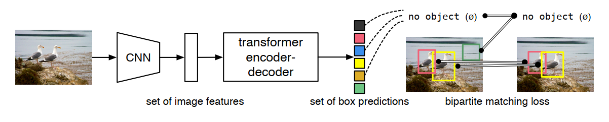
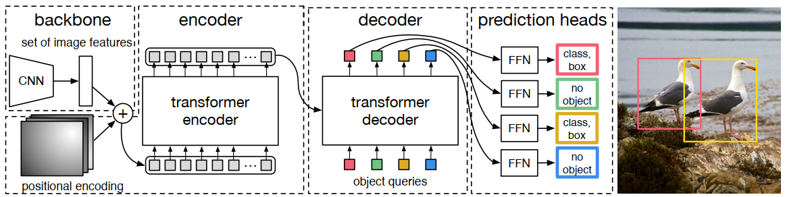
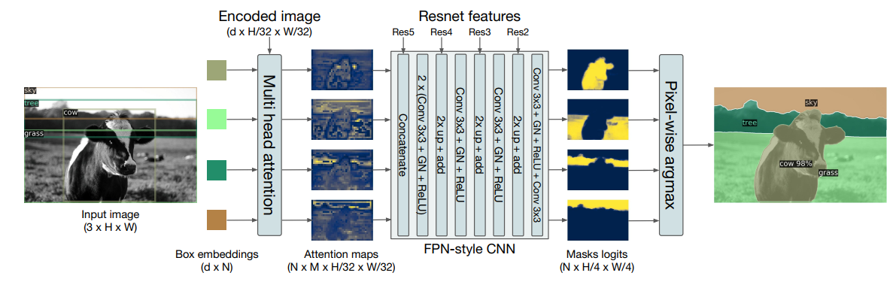
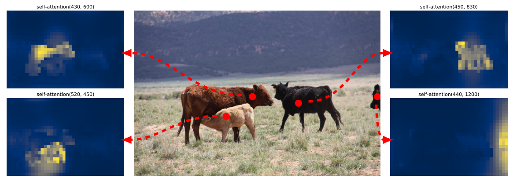
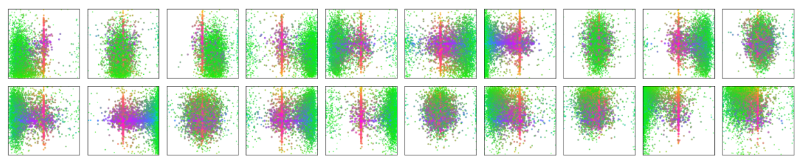

# Literature review

There were many approaches to apply deep-learning models on video domain. It is not as easy as it seems to be however. Naive approach is just to add an extra dimension (this is called 3D convolution). Such an operation is extremely hard to perform on real-world devices, it takes too much computational resources. The second problem with naive approach is that connectivity patterns in temporal dimension could be more complicated and therefore a more flexible architecture is needed. Authors in [@karpathy_large-scale_nodate] propose standardized approaches to build such a system that can capture temporal dimension features more accurate then models used before. They acheaved up to 63% accuracy on their dataset compared to 43% baseline model.

While [@karpathy_large-scale_nodate] enjoys temporal dimension as-it-is, in [@lin_tsm_2019] authors propose an architecture to separate channels and shift some of them along time axes. 

Another very important domain in computer vision is object detection. In [@carion_end--end_2020] they propose an interesting idea to use transformer architecture in object detection. Attention mechanism here quite naturally lies on the logics of bounding boxes detection.

One of the most important milestone papers on CNNs is [@simonyan_very_2015]. Authors here for the first time propose using deep architecture. They also claim that receptive field of 7x7 filter layer can be easily represented as a sequence of 3x3 filter layers. 3x3 layers, however, can be computed much more efficiently.

# 1. Large-scale Video Classification with Convolutional Neural Networks

Authors tried to solve task of video recognition given a video clip. There were several questions needed to answer, one of them was "What temporal connectivity pattern in CNN is the best at taking advantage of local motion information presented in video [@karpathy_large-scale_nodate].

The standard approach usually follows this scheme:

1. Extract local features that describe a region of video.
2. Then from features we got we can build an entire video representation.
3. Lastly apply some kind of Machine learning technique such as SVM etc.

On the [@fig:large_scale_approaches] you can see main approaches proposed by authors. So, basically this figure shows different approaches to select target frames for convolution.

{#fig:large_scale_approaches}

After convolving we get a low-dimensional data, which then can be used as input for any classifier.

They also propose using two separates flows for better performance as shown on [@fig:large_scale_flows].

{#fig:large_scale_flows}

Using fine-tuning technique they acheaved 65% accuracy.

# 2. TSM: Temporal Shift Module for Efficient Video Understanding

In [@lin_tsm_2019] divide regular convolution of time series on two parts: *shift* and *multiply-accumulate*. This makes it possible to change each of those two independently.

We first define a general architecture. Here we shift some of channels as it shown on [@fig:shift-tsm].

{#fig:shift-tsm}

Shift is applied parallel to residual connection, as it shown on [@fig:in-place-residual-tsm]. It's done to stabilize operation.

{#fig:in-place-residual-tsm}

And finally, we can see that We can cache data in memory [@fig:uni-ditectional-ts]. We can do that because we shift channels along axes, so some information can be reused in next farms computation.

{#fig:uni-ditectional-tsm}

They acheaved a great performance on the same dataset as [@karpathy_large-scale_nodate], but what is more important, purposed framework makes convolution 10 times faster due to its non-filter nature. We don't use sliding window at all, we shift channels and convolve it linearly instead.

# 3. End-to-End Object Detection with Transformers

In [@carion_end--end_2020] authors propose a way of object detection with the use of transformers. First, I wanna talk about abilities and limitations of the final model. It's impossible to train this model without object recognition part (with only object window detection) because the final loss stonily depends on classification loss. It is important to use *backbone CNN* before feeding data to transformer because it reduces a dimensionality and improves performance. Position encoding is also required because transformers are position invariant.

This model can be used in object detection task [@fig:object-detection], visualizing attention, panoptic segmentation (segmentation based on object contained in segment) [@fig:panoptic-segmentation].

{#fig:object-detection}

{#fig:panoptic-segmentation}

Now about architecture [@fig:architecture-transformer]. In general it consists of following steps:

1. Encode image with CNN. Obtain intermediate representations.
2. Flatten it and apply positional encoding.
3. Pass through transformer and obtain box predictions.

{#fig:architecture-transformer}

Let me explain architecture in detail [@fig:architecture-details].

1. Backbone network. Here we can use any CNN as backbone, we just cut the upper layers to get some kind of intermediate feature representations.
2. Positional encoding. Actually this is a part of classical transformer architecture. It is obvious that we need somehow encode obtained features before passing it through transformer, because we positional characteristics of output boxes is important too.
3. Transformer encoder is just original encoder. It outputs transformed embeddings.
4. Transformer decoder gets those embeddings and use as keys and values. Queries, however in this architecture are obtained during training process. It can bee seen as some kind of local attention [@fig:queries-transformer]. Each query looks at specific part of an image and trying to find an object borders there.

{#fig:architecture-details}

Segmentation architecture can be seen on [@fig:segmentation-architecture].

{#fig:segmentation-architecture}

Visualized encoder attention can be seen on [@fig:object-attention].

{#fig:object-attention}

Trained queries can be seen on [@fig:queries-transformer]. In their implementation they used 100 different queries, each of those queries then recognize an object or No-Object class. So the maximum of recognized objects is 100.

{#fig:queries-transformer}

At the very end they apply FFN and softmax.

They used three losses. Two of them are classification loss and object bounded boxes loss.

# 4. Very Deep Convolutional Networks for Large-Scale Image Recognition

Authors in [@simonyan_very_2015] propose a general architecture pattern for any deep CNN. To summarize their impact I listed their main contributions:

1. 3x3 layers should be used as a main building block in deep CNN. Convolution with bigger filter size can be decomposed through 3x3 filter stack (with non-linearity injected in between).
2. 1x1 layers can be seen as non-linearity. It takes not a lot to propagate through such layers, because of low computation cost.
3. Batch training is efficient. It is better to average all the gradients within full batch.
4.  The classification error decreases with increased depth of CNN. They figure out that 19 layers in their experiments show dramatically higher performance than 11 layers.

# Reference 