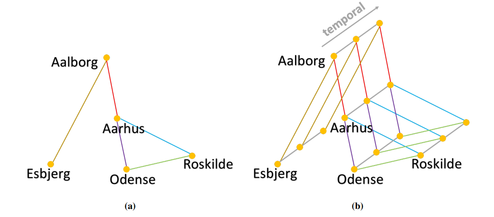
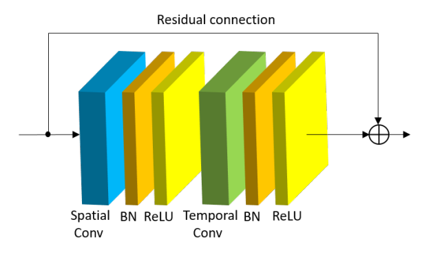
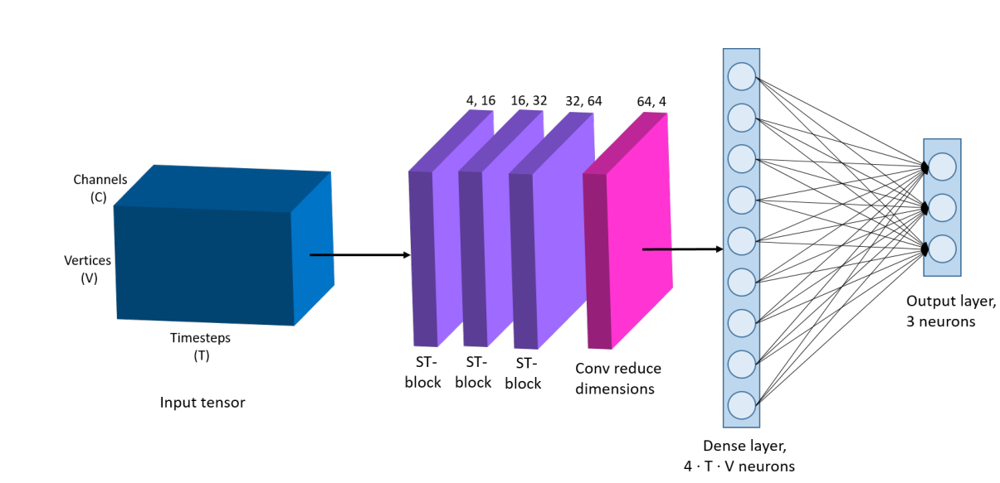

# Literature review

There are many applications of GNNs in engineering problems. In [@stanczyk_deep_2021] authors used GNN as a block in their architecture to predict weather at certain points. They used a historical data to train a model. They came up with spatio-temporal convolution block, which incorporates methods to convolve data in space and then in time. That allows us to process time-series of graph-like data. The main contribution here is that they *learn adjacency matrix*.

Problem from above paragraph can be seen as identifying a topology of underlying graph in dataset. In [@araghi_dynamic_2021] authors try to solve a problem of clustering temporal graph signals, what means that not only graph features, but graph structure is also evolving in time.

There are several problems in GNNs now, two most attractive for researches are:

1. Depth of the network. The network cannot be very deep for two main reasons. First of all the information is being smoothed way too fast and computation cost is too high. There was an approach to construct a really deep network [@chen_simple_2020].
2. Computation optimization. Even 3-4 layer GNN uses unpredictable growing amount of computations. There were approaches to reduce computational cost [@wu_simplifying_2019][@hamilton_inductive_2017].

Authors in [@yang_spagan_2021] propose an approach that can particularly solve this issue. Especially the second one.

# 1. Deep Graph Convolutional Networks for Wind Speed Prediction

There is a time-series data of several cities in Denmark and Netherlands. The task is to build a model that is able to forecast weather conditions based on already learned data. There were many approaches to model atmosphere as a fluid flow, as well as machine learning approaches. The new way to build a model is considering weather station as nodes in a graph, then learn adjacency matrix from existing data, which then can be used in prediction.

First let us see the data itself on the [@fig:wind-prediction].

{#fig:wind-prediction}

Here we with graph evolving in time, but having a constant number of vertices. So, the task is to learn it's spacial structure, which can be represented by adjacency matrix.

They define spatial convolution as [@eq:wind-convolution].

$$
X_{out}=X_{in}(\hat{D}^{-\dfrac{1}{2}}\hat{A}\hat{D}^{-\dfrac{1}{2}})
$$

They then apply regular 2D convolution along temporal dimension. Batch normalization and ReLU activation are being applied after each layer [@fig:wind-layer].

{#fig:wind-layer}

They then stack three these layers completing it with convolution layer to reduce dimension and fully-connected layer.

{#fig:wind-architecture}

One mistake here is that they specified 3 output cities, but both datasets contain 5 and 7 cities.

# 2. SPAGAN: Shortest Path Graph Attention Network

$$
\vec{h'}_{i,j, (l)}=W^{(k)}\vec{h}_{j, (l-1)}
$${#eq:spagan_linear}

$$
\alpha^{(k)}_{i,j,(l)}=\dfrac{exp(\sigma\langle\vec{a},\vec{h'}_{i,(l)}||\vec{h'}_{j,(l)}\rangle)}{\sum_{j\in N_i}exp(\sigma\langle\vec{a},\vec{h'}_{i,(l)}||\vec{h'}_{j,(l)}\rangle)}
$${#eq:spagan_basic_attention}

$$
\vec{h'}_{i,(l)}=\sigma'\{aggr^K_{k=1}\{\sum_{j\in N_i}\alpha^{(k)}_{i,j,(l-1)}\vec{h'}_j\}\}
$${#eq:spagan_basic_feature_update}

$$
W_{i,j}=\dfrac{1}{K}\sum_{k=1}^{K}{\alpha^(k)_{i,j,\bar{l}}}
$${#eq:spagan_edge_weight}

$$
$${#eq:}

$$
$${#eq:}

$$
$${#eq:}

$$
$${#eq:}

$$
$${#eq:}

$$
$${#eq:}

# Reference 