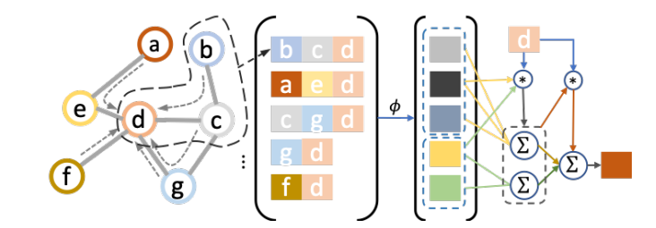
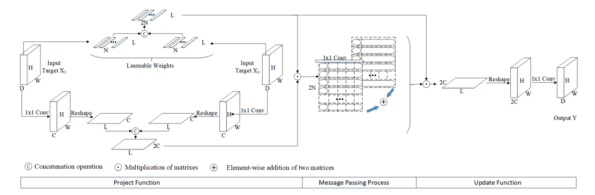
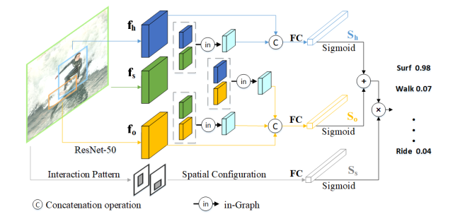
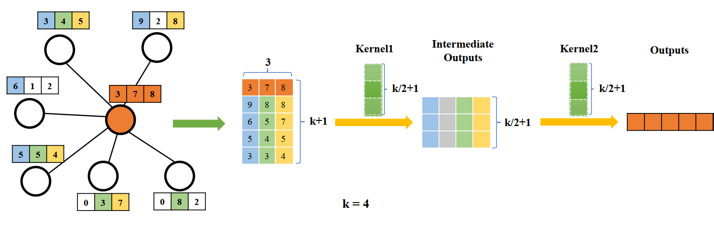
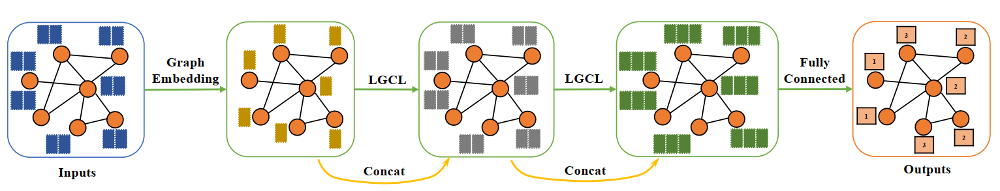
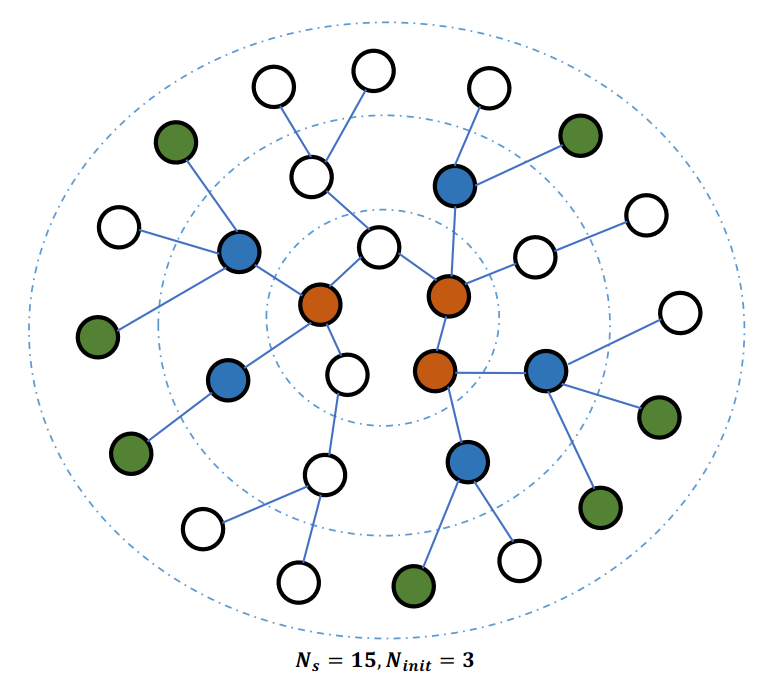
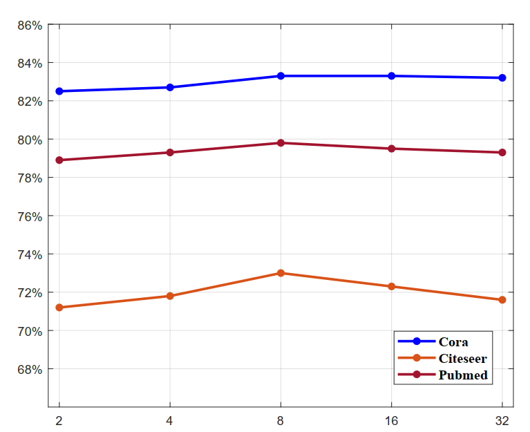

# Literature review

There are many applications of GNNs in engineering problems. In [@stanczyk_deep_2021] authors used GNN as a block in their architecture to predict weather at certain points. They used a historical data to train a model. They came up with spatio-temporal convolution block, which incorporates methods to convolve data in space and then in time. That allows us to process time-series of graph-like data. The main contribution here is that they *learn adjacency matrix*.

Problem from above paragraph can be seen as identifying a topology of underlying graph in dataset. In [@araghi_dynamic_2021] authors try to solve a problem of clustering temporal graph signals, what means that not only graph features, but graph structure is also evolving in time.

There are several problems in GNNs now, two most attractive for researches are:

1. Depth of the network. The network cannot be very deep for two main reasons. First of all the information is being smoothed way too fast and computation cost is too high. There was an approach to construct a really deep network [@chen_simple_2020].
2. Computation optimization. Even 3-4 layer GNN uses unpredictable growing amount of computations. There were approaches to reduce computational cost [@wu_simplifying_2019][@hamilton_inductive_2017].

Authors in [@yang_spagan_2021] propose an approach that can particularly solve this issue. Especially the second one.

In CV there is a field of human-object interaction (HOI). In this field the task is to build such models that can given an image output a triplet of \<human, action, object\>. In [@yang_graph-based_2020] authors propose to project objects from an image to some kind of graph. Then they use message passing, project it back and finally apply convolutions to obtain predictions.

Scaling models is always a problem in deep learning. Model can work well on small datasets, but in case of large datasets there could be a problems. At the end everything depends on computation complexity and memory complexity. In [@gao_large-scale_2018] authors propose a model that is scalable on large graphs.

# 1. Deep Graph Convolutional Networks for Wind Speed Prediction

There is a time-series data of several cities in Denmark and Netherlands. The task is to build a model that is able to forecast weather conditions based on already learned data. There were many approaches to model atmosphere as a fluid flow, as well as machine learning approaches. The new way to build a model is considering weather station as nodes in a graph, then learn adjacency matrix from existing data, which then can be used in prediction.

First let us see the data itself on the [@fig:wind-prediction].

{#fig:wind-prediction}

Here we with graph evolving in time, but having a constant number of vertices. So, the task is to learn it's spacial structure, which can be represented by adjacency matrix.

They define spatial convolution as [@eq:wind-convolution].

$$
X_{out}=X_{in}(\hat{D}^{-\dfrac{1}{2}}\hat{A}\hat{D}^{-\dfrac{1}{2}})
$$

They then apply regular 2D convolution along temporal dimension. Batch normalization and ReLU activation are being applied after each layer [@fig:wind-layer].

{#fig:wind-layer}

They then stack three these layers completing it with convolution layer to reduce dimension and fully-connected layer.

{#fig:wind-architecture}

One mistake here is that they specified 3 output cities, but both datasets contain 5 and 7 cities.

# 2. SPAGAN: Shortest Path Graph Attention Network

In [@yang_spagan_2021] authors trying to solve a problem of calculating K-hop neighbors. They overcome a huge amount of computations by representing all the K-hop neighbors as a shortest path to that neighbor within a single convolution layer as it is shown on the [@fig:spagan_convolution].

{#fig:spagan_convolution}

Let me explain step by step what is happening in the core of their algorithm. I will first remind how does a regular attention mechanism work. First all the features are linearly transformed [@eq:spagan_linear]

$$
\vec{h'}_{i, (l)}=W^{(k)}_{(l)}\vec{h}_{j, (l-1)}
$${#eq:spagan_linear}

Then attention matrix is calculated [@eq:spagan_basic_attention], where $\vec{a}$ is learnable.

$$
\alpha^{(k)}_{i,j,(l)}=\dfrac{exp(\sigma\langle\vec{a},\vec{h'}_{i,(l)}||\vec{h'}_{j,(l)}\rangle)}{\sum_{j\in N_i}exp(\sigma\langle\vec{a},\vec{h'}_{i,(l)}||\vec{h'}_{j,(l)}\rangle)}
$${#eq:spagan_basic_attention}

Afterwards next level feature representation is obtained by [@eq:spagan_basic_feature_update]

$$
\vec{h'}_{i,(l)}=\sigma'\{aggr^K_{k=1}\{\sum_{j\in N_i}\alpha^{(k)}_{i,j,(l-1)}\vec{h'}_j\}\}
$${#eq:spagan_basic_feature_update}

In their architecture it is required to know edge weights for calculating the shortest paths [@eq:spagan_edge_weights]

$$
W_{i,j}=\dfrac{1}{K}\sum_{k=1}^{K}{\alpha^{(k)}_{i,j,\bar{l}}}
$${#eq:spagan_edge_weight}

Then Dejkstra algorithm is applied and $P^c$ shortest paths for each $c$ in possible lengths is obtained. Then we select top k shortest paths [@eq:spagan_neighbor_sampling]. This makes an algorithm more predictive in sense of possible amount of neighbors for computation.

$$
N^c_i=top_k(P^c), k=\tilde{deg_i}*r
$${#eq:spagan_neighbor_sampling}

Then layer representation is obtained [@eq:spagan_convolution]. Where attention and function $\phi$, that maps a various size paths to fixed size, are used.

$$
l^c_i=pool^K_{k=1}\{\sum_{p^c_{i,j}\in N^c_i}\alpha^{(k)}_{i,j}\phi(p^c_{i,j})\}
$${#eq:spagan_convolution}

Attention is calculated by following formula [@eq:spagan_attention].

$$
\alpha^{(k)}_{i,j}=AT(\vec{h'}_i,\phi(p^c_{i,j})|a_\alpha)
$${#eq:spagan_attention}

Function $AT$ is calculated in [@eq:spagan_attention_function].

$$
AT(a,b|\theta)=\dfrac{exp(\sigma\langle\theta,a||b\rangle)}{\sum_{j\in N_i}exp(\sigma\langle\theta,a||b\rangle)}
$${#eq:spagan_attention_function}

Final node representations are obtained according to [@eq:spagan_second_layer].

$$
\vec{h}_i=\sigma\{\sum_{c=2}^{C}\beta_cl^c_i\}
$${#eq:spagan_second_layer}

Where

$$
\beta_c=AT(\vec{h'}_i,\phi(p^c_{i,j})|a_\beta)
$${#eq:spagan_second_layer_attention}

There are hyperparameters, that can be adjusted by developer. They give a review of various values of hyperparameters in their paper.

# 3. A Graph-based Interactive Reasoning for Human-Object Interaction Detection

In [@yang_graph-based_2020] authors propose using graph convolution to detect pairwise interaction. On the [@fig:hoi-architecture].

{#fig:hoi-architecture}

Here we can see that first projection to graph space is applied, then graph convolution and finally projection back and recognition.

On [@fig:graph-layer] we can see architecture in detail. In particular there is a clear explanation how is projection applied. We can see that the mechanism doesn't use much parameters, thus computational cost is not really high.

{#fig:graph-layer}

At the very end of projection function we can see linear combination of two matrices, which then returns a vertex features. So, we ge get a fully-connected graph.

Then we convolve it and get new features. Afterwards convert it back using residual connection from projection part.

On the picture [@fig:whole-architecture] we can see the whole network architecture, we can see that image, person and object features are combined during training. This helps model to learn interaction.

{#fig:whole-architecture}

Quite interesting paper. But writing style is quite difficult.

# 4. Large-Scale Learnable Graph Convolutional Networks

First, this paper is quite old, it's from 2018. Their approach is not really difficult, I am going to introduce their graph convolutional layer and then present an entire model and their sampling algorithm. At the end I am going to note pros and cons.

LGCL layer is demonstrated on the [@fig:lgcl-layer]. Here the main idea is to utilize top $k$ greatest values in convolution for each feature in graph. Here we can see that there are 3 features and 6 neighboring nodes. Which then is reduced to $k=4$ top features. As we can see, they decided not to keep initial node features, constructing a new feature rows. Then two 1-d convolutions are being applied.

{#fig:lgcl-layer}

Then using previously defined layer we can construct a whole network by stacking LGCL together. At the end they apply fully-connected layer to obtain new features. They also use residual connections and concatenation for the sake of stability.

{#fig:lgcl-flow}

It's trivial to train such network on small dataset, but large datasets, say 1000 nodes and more are much more difficult to train on. On the [@fig:lgcl-sampling] the sampling algorithm is proposed. They randomly select $N_{init}$ nodes and then do BFS to build maximum $N_{init}$ trees.

{#fig:lgcl-sampling}

Results can be seen down below on [@fig:lgcl-results].

{#fig:lgcl-results}

One more thing: according to their study, whole graph training is slightly more effective then sampling and training. That is understandable.

# Reference 