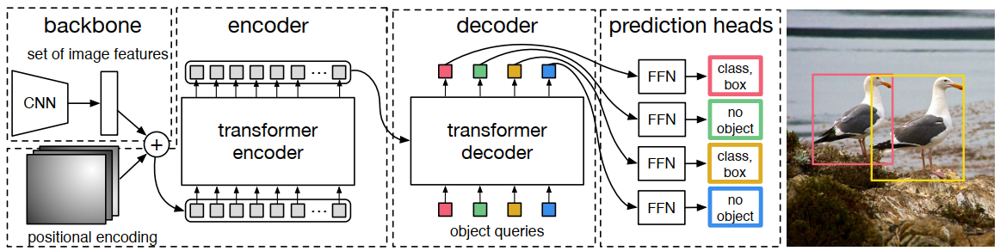
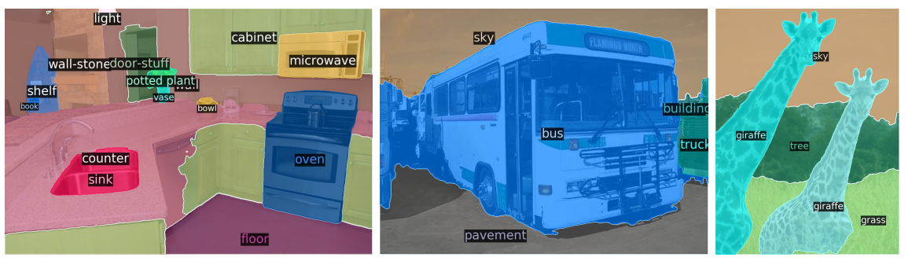
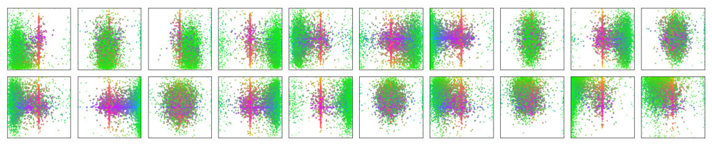

# End-to-End Object Detection with Transformers

## Nikita LS1906205 report

---

# Table of content

1. Introduction
2. Transformer recap
3. Architecture
4. Visual attention
5. Intuition

---

# 1. Introduction

- Object detection
- Transformers and attention
- DETR parallelism
- Duplicates problem

---

# 2. Transformer recap

- Encoder-Decoder architecture
- Parallel encoder
- Attention

---

# 2. Transformer recap
## Self-attention

$$
Attention(Q,K,V)=softmax(\dfrac{QK^T}{\sqrt{d_k}})V
$$

---

# 2. Transformer recap

---

# 2. Transformer recap

---

# 2. Transformer recap

---

# 3. Architecture

---

# 3. Architecture

---

# 4. Visual attention

---

# 4. Visual attention

---

# 4. Visual attention

---

# 5. Intuition

---

# 5. Intuition

---

# 6. Conclusion

---

// put loss, put some text, some formulas. The information should be complete within a presentation.

// background overview and motivation, contribution, other works review.

// Stanford university online course on CNN

// CS231n