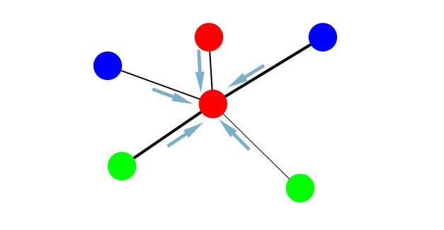

# graph convolutional network survey with applications
## ls1906205 nikita

---

# content

 - graph processing introduction
 - preliminary and background
   - graph representation
   - convolution on graph
 - learning on graphs
   - spectral learning
   - spatial learning
 - applications

 ---

 # graph processing introduction

now cnns are used in variety of tasks as a model for approximation and generalization on some specific domain. for example image or voice recognition or some other structured data.

it is not easy to apply cnn architecture on graph data since graphs are not grids and they don't have a fixed structure. there are many approaches in recent 5 years to design algorithms with architecture similar to cnn, but capable to deal with graph data, let's call it as *graph convolution*.

 ---

 # preliminary and background

 ---

 # graph representation

let graph $g$ have a node set $v\in v$ and edge set $e\in e$. such graph can be represented as square adjacency matrix $a\in \mathbb{z}^{n\times n}$, where $a_{ij}=0$ if nodes $v_i$ and $v_j$ are not connected. otherwise, if nodes are connected, then $a_{ij}$ is equal to the weight of the edge $e_{ij}$ between nodes $v_i$ and $v_j$.

 ---

 # convolution on graph

traditionally there are two completely different group of methods in graph learning.

**spectral methods** are based on graph laplacian matrix and it's eigen-decomposition. there are several points to notice at first: spectral methods are slightly more difficult and intuition is not obvious; to apply spectral convolution a fixed size graph is required for both learning and evaluation process (so, it can be used on such datasets as human skeleton or other fixed-size small graphs).

**spatial methods** are more intuitive for those who familiar with cnns since in these methods neighbor aggregation is almost similar with neighbor aggregation in cnns. since spatial methods can be applied on graphs with arbitrary size and arbitrary structure (instead fixed size in case of spectral methods), it leads to computational instability of spatial methods.

 ---

 # learning on graphs

basically most of existing frameworks can be expressed in a way presented in. so, both aggregate and combine steps are customizable, and essentially in those steps the main differences between architectures happens.

$$
h_i^{(l)}=combine(h_i^{(l-1)}, aggregate(v_j\in n_i))
$$

where $h_i^{(l)}$ is a state of node $v_i$ after layer $l$ and $n_i$ are neighbors of node $v_i$

 ---

 # Spectral learning I

Spectral learning methods imply **eigen-decomposition of graph laplacian**. Graph laplacian reflects a smoothens of graph, or in other words how different is each node from it's neighbors. Eigen-decomposition is a representation of matrix with it's eigenvectors and eigenvalues. Eigenvectors are thought as an independent components and eigenvalues as a frequencies or strengths of those components. Then similar to Fourier filters, we use graph Laplacian filter which basically affects **eigenvalues diagonal matrix**.

 ---

# Spectral learning II

Eigen-decomposition of Graph Laplacian:

$$
L=U\Lambda U^T
$$

Parametrized eigen-decomposition:

$$
g_\theta\star x=Ug_\theta(\Lambda) U^Tx
$$

Example kernel:

$$
g_\theta(\Lambda)=\sum_{k=0}^{K-1}\theta_kT(\tilde{\Lambda})
$$

Another example:

$$
g_{c,h}(\Lambda)=c_0+2Re\{\sum_{j=0}^{r}c_j(h\Lambda-i)^j(h\Lambda+i)^{-j}\}
$$

 ---

 # Spatial learning

Spatial learning methods are based on spatial interpretation of graph, convolution is defined as aggregation neighboring nodes information for each node.

$$
AGGREGATE^{pool}_k=max({\sigma(W_{pool}h^k_{u_i}+b), \forall_{u_i}\in N(v)})
$$
 ---

 # Applications

 - human-object interaction detection
 - object detection
 - emergency medical service demand
 - action recognition
 - city traffic forecasting
