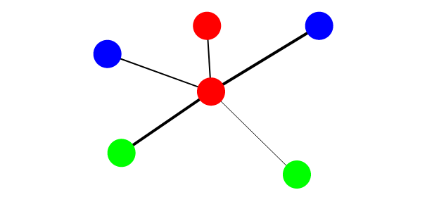

# 1. Introduction

Convolutional neural networks have shown a high performance in several fields during recent years. Power of convolutional neural networks (CNNs) is mainly in their ability to take a local features into account. It turns out that CNN architecture is extremely good and effective when we deal with *structured data*. In early beginning of CNNs one of the milestone works was VGG-19 [@Simonyan_Zisserman_2015] and AlexNet [@Krizhevsky_Sutskever_Hinton_2017], here authors proved that convolutional architectures can be way more computationally effective. It has also been shown that learned convolutional filters can reflect a local structure of sample.

Nowadays CNNs are used in a variety of tasks such as classification, generation, clustering, dimensionality reduction etc. The main disadvantage of CNNs, however, is that it is domain specific. Due to grid nature of CNN, it is quite challenging to apply such architecture on such objects as road map, molecule or even human skeleton etc. Let me remind that all the listed objects are traditionally modeled as some kind of graph [@fig:1]. It is clear that it's impossible to apply CNN on graph data directly due to it's non-euclidean nature.

{#fig:1}

Such structure can be used to describe elements and connections among them. For example human skeleton, where elements are joints and connections are bones. Since graphs are quite representative, we would like to use it directly in all the variety of tasks such as graph classification, node classification, labeling etc. There are many approaches in recent years to apply mentioned above convolutional architecture on graph structured data.

# 2. Preliminary and background

There are some theoretical knowledge that are required to understand graph neural networks (GNNs). In this part author is going to give reader an introduction to graph processing.

## 2.1. Graph representation

Let graph $G$ have a node set $v\in V$ and edge set $e\in E$. Such graph can be represented as square adjacency matrix $A\in \mathbb{Z}^{N\times N}$, where $A_{ij}=0$ if nodes $v_i$ and $v_j$ are not connected. Otherwise, if nodes are connected, then $A_{ij}$ is equal to the weight of the edge $e_{ij}$ between nodes $v_i$ and $v_j$.

It is important to notice that if graph $G$ is undirected, then $A$ is *symmetric*. This property is quite useful and it will be used later.

## 2.2. Convolution on graph

Conceptually, convolution operation in CNNs is used to *aggregate* data from fixed neighborhood. For example in pictures it is neighboring pixels (first-order neighbors in case of $3\times 3$ filter, first-order and second-order neighbors in case of $5\times 5$ filter etc.). After that an activation function is being applied. This is the simplest pipeline, and, of course, there is quite a bit of optional layers such as pooling or residual [@He_Zhang_Ren_Sun_2015].

After summarizing the main concepts of CNNs we can then start thinking about applying similar architecture on graph domain. There is one important point which is needed to be mentioned before we start: all the methods here are based on statement that node (or edge) in graph is largely determined by its neighbors. This point is quite important since all the approaches mentioned below perform some kind of *aggregating a neighboring information* and then making assumptions on node itself based on this aggregated information.

Traditionally there are two completely different group of methods in graph learning.

**Spectral methods** are based on graph Laplacian matrix and it's eigen-decomposition (details will be shown next). There are several points to notice at first: Spectral methods are slightly more difficult and intuition is not obvious; To apply spectral convolution a fixed size graph is required for both learning and evaluation process (so, it can be used on such datasets as human skeleton or other fixed-size small graphs); In general case graph has to be undirected.

**Spatial methods** are more intuitive for those who familiar with CNNs since in these methods neighbor aggregation is almost similar with neighbor aggregation in CNNs. Since spatial methods can be applied on graphs with arbitrary size and arbitrary structure (instead fixed size in case of spectral methods), it leads to computational instability of spatial methods.

# 3. Learning on graphs

Basically learning on graphs consists of several steps:

1. **Aggregate**. On this step we gather information from neighboring nodes and summarize it.
2. **Combine**. On this step we combine aggregated information and own information of current node.

Basically most of existing frameworks can be expressed in a way presented in [@eq:4]. So, both aggregate and combine steps are customizable, and essentially in those steps the main differences between architectures happens.

$$
h_i^{(l)}=COMBINE(h_i^{(l-1)}, AGGREGATE(v_j\in N_i))
$${#eq:4}

Where $h_i^{(l)}$ is a state of node $v_i$ after layer $l$ and $N_i$ are neighbors of node $v_i$.

## 3.1. Spectral learning

Spectral learning methods imply eigen-decomposition of graph Laplacian. Graph Laplacian [@eq:1] reflects a smoothens of graph, or in other words how different is each node from it's neighbors. Then similar to Fourier filters, we use graph Laplacian filter [@eq:3].

$$
L=A-D
$${#eq:1}

Paper [@Kipf_Welling_2017] is one of the earliest works in sphere of geometric deep learning. Since they did want graph Laplacian matrix to reflect smoothens of the graph, but they also needed a numerical stability, they used a slightly different form of graph Laplacian [@eq:2], and it is called *renormalization trick*.

$$
L=\tilde{D}^{-\dfrac{1}{2}}\tilde{A}\tilde{D}^{-\dfrac{1}{2}}
$${#eq:2}

Where $\tilde{D}_{ii}=\sum_j{A_{ij}}$ and $\tilde{A}=A+I_N$, $I_N$ is an identity matrix.

They then define their convolution as in [@eq:3]

$$
g_\theta\star x=Ug_\theta(\Lambda) U^Tx
$${#eq:3}

Where $U\Lambda U^T$ is eigen-decomposition of $L$. $U$ is matrix of eigen-vectors and $\Lambda$ is diagonal matrix of eigen-values. So $g_\theta(\Lambda)$ parametrizes this diagonal matrix with learnable parameters.

Since in undirected graphs $A$ is symmetric, graph Laplacian $L$ is also symmetric, which means that such matrix has $N$ unique eigen-values and corresponding eigen-vectors.

In [@Defferrard_Bresson_Vandergheynst_2016] authors propose using Chebyshev polynomials as a filter kernel [@eq:5]

$$
g_\theta(\Lambda)=\sum_{k=0}^{K-1}\theta_kT(\tilde{\Lambda})
$${#eq:5}

Where $T_k$ is Chebyshev polynomial of order $k$.

In [@Levie_Monti_Bresson_Bronstein_2019] authors use Cayley polynomials [@eq:6] as a filter kernel.

$$
g_{c,h}(\Lambda)=c_0+2Re\{\sum_{j=0}^{r}c_j(h\Lambda-i)^j(h\Lambda+i)^{-j}\}
$${#eq:6}

Where $c$ and $h$ are optimized during training and $Re$ returns a real part of complex number. They call $h$ spectral zoom, this learnable parameter in essence determines what frequencies are more important and what frequencies are less important in graph spectrum.

In [@Monti_Otness_Bronstein_2018] they used a notion of *motifs* - small directed graphs to encode original graph structure. Benefit from such approach is that since we encode graph before convolution, it is not required to be undirected. In [@Dwivedi_Bresson_2020] they applied transformer [@Vaswani_Shazeer_Parmar_Uszkoreit_Jones_Gomez_Kaiser_Polosukhin_2017] architecture on graph, they used graph Laplacian eigenvalues as a positional encoding.

There is a problem with building a deep networks, because it requires quite a lot of matrix multiplications to compute, and what is more important, each layer needs a matrix of learnable parameters. In [@Wu_Zhang_Souza_Jr_Fifty_Yu_Weinberger_2019] they claim that only one matrix of parameter is needed, and that we can simplify multiple layers of graph convolution to one single layer, they proposed. Only one parameter matrix will be needed, therefore number of multiplications will dramatically decrease. Recently there was another approach in [@Chen_Wei_Huang_Ding_Li_2020], they introduced a residual connection from initial state, so they solved an oversmoothing problem, which is quite common in spectral architectures. The signal decays quite fast, and usually stacking no more then 4 layers are used. They reached a reasonable performance with their residual architecture on up to 64 layers deep network.

## 3.2. Spacial learning

Spatial learning methods are a bit more intuitive, because there is a visual interpretation. All those methods are based on spatial interpretation of graph, convolution is defined as aggregation neighboring nodes information for each node.

In [@Hamilton_Ying_Leskovec_2018] they propose in some sense improved version of vanilla graph convolution. New algorithm was called GraphSAGE. The main contribution is an idea to use $N(v)$ function for *sampling* neighbors. This function basically takes up to $\gamma$ neighbors of a node instead of taking into account all existing neighboring nodes.

Aggregator with such setting is determined by [@eq:GraphSAGE_aggregator]. Here max pooling is being used.

$$
AGGREGATE^{pool}_k=max({\sigma(W_{pool}h^k_{u_i}+b), \forall_{u_i}\in N(v)})
$${#eq:GraphSAGE_aggregator}

In fact we learn function of neighbors instead of calculating a whole graph embeddings, what allows us to apply same learned function on a new completely unseen nodes. In [@Gao_Wang_Ji_2018] similar approach is being used. Since one layer propagates signal to from (or to) one-hop neighbors, we need $d$ depth tree for each node to propagate a signal through $d$ layers. They first build a subtrees fro each node, sampling neighbors, then propagate a signal. It is also important that they use skip connections, it works similar to residual layer from [@He_Zhang_Ren_Sun_2015].

Similar to [@Vaswani_Shazeer_Parmar_Uszkoreit_Jones_Gomez_Kaiser_Polosukhin_2017], in [@Velicković_Cucurull_Casanova_Romero_Liò_Bengio_2017] authors purpose attention mechanism, which can be simply thought as an additional learnable parameter.

Attention can be calculated using following formula [@eq:7]:

$$
\alpha_{i,j}=\dfrac{exp(LeakyReLU(\vec{a}^T[W\vec{h_i}||W\vec{h_j}]))}{\sum_{k\in N_i}exp(LeakyReLU(\vec{a}^T[W\vec{h_i}||W\vec{h_k}]))}
$${#eq:7}

Where W are learnable parameters. Next layer representation is then computed as in [@eq:8]

$$
h_i^{(l)}=\sigma(\dfrac{1}{K}\sum_{k=1}^{K}\sum_{j\in N_i}{\alpha^k_{i,j}W^kh^{(l-1)}_j})
$${#eq:8}

Here the only new idea is to put an attention mechanism. There are different ways of applying attention:

- Use multiple attentions per edge. This is called multi-head attention.
- Attention weights can be either concatenated or averaged.

So, attention is a method to weight an edge according to its importance to node.

In [@Bai_Cui_Jiao_Rossi_Hancock_2019] authors propose a way to surpass limitation of fixed-size graph by *aligning* graph to some known graphs, they call such graphs *backtrackless aligned grid*. Then apply spatial convolution.

In [@Yang_Wang_Song_Yuan_Tao_2021] they use shortest path to compute Dejkstra algorithm to build a subtree, so they avoid redundant computations and the paths are more unique, which also helps to aggregate information more effective and helps to take into account remote neighbors in more stable way.

In [@Fey_Lenssen_Weichert_Muller_2018] they used B-Spline approximation in convolution kernel. The main advantage of their approach is that 

# 4. Applications

All the techniques mentioned above work with graph data, the minimal requirement for dataset we want to learn is graph structure. There are various fields to apply graph neural network models.

In [@Yang_Zou_2020] authors use gnn in task of human-object interaction detection. They first project two feature tensors (regions of image, recognized as object and human) on graph space, where all nodes are connected. Then message passing is applied, which propagates a given signal through graph. Afterwards they project all the convolved features back to convolutional space and apply fully connected layers to get probabilities.

In [@Gu_Tresp_2020] they apply GNN as an intermediate layer in object detection using capsule networks. They use term *capsule* to describe some region of image (for example face features like eyes or nose), which is important for recognition of an object. Then they perform a graph convolution, propagating signal through graph obtained from primary extracted *capsules*. Then concatenate features, reduce dimension and apply fully-connected layer.

Recently there was [@Jin_Xia_Liu_Murata_Kim_2021], where they use gnn to predict emergency medical service demand and model city healthcare infrastructure. They have bipartite graph of regions and hospitals. They apply graph convolution.

It is clear that applying a GNN or GNN we won't get any adequate results. Graph structure is too specific [@eq:bigcn_adjacency_matrix_structure].

$$
A=\begin{bmatrix}
  0_{M\times M} & B_u \\
  B_v & 0_{N\times N}\\
\end{bmatrix}
$${#eq:bigcn_adjacency_matrix_structure}

Where $B_u$ and $B_v$ are adjacency matrixes for hospital nodes $u\in U$ and for regions $v\in V$ and other elements are zeros because we know the graph is bipartite (node from $U$ can only be connected to node from $V$ and opposite).

There is an approach [@Cheng_Zhang_He_Chen_Cheng_Lu_2020] to apply graph neural network in action recognition. Authors use temporal dimension to generalize information from a set of video frames.

Given a video mapped skeleton data they want to classify skeleton movement. In this task they again face a problem of locality. For example, classify "clap" we need to know about state of some distant nodes, but some other distant nodes are not as important. So, in case of "clap" we might be interested in states of left and right palms, but less interested in other body parts state. GNN wont work well in this case due to it's k-hop neighbors locality limitation.

Authors purpose a method with the main idea borrowed from CNN's field, which is called Shift convolution [@Wu_Wan_Yue_Jin_Zhao_Golmant_Gholaminejad_Gonzalez_Keutzer_2017]. In CNN shift is a special kind of channel-wise convolution, but with, in some sense, special filters. Each filter contains only one non-zero element, so it can be implemented in more efficient way.

In [@Cui_Henrickson_Ke_Wang_2020] they propose using gnn in city traffic forecasting.

# 5. Conclusion

In general graphs are quite flexible data structure. Using graph data and graph processing algorithms increases performance in different tasks such as classification, time-series forecasting, computer vision tasks etc.

Recent theoretical researches have proposed a convenient and interpretable architectures using spectral and spatial approaches. The vast majority of recent papers mainly develop spatial methods. There were improvements such as simplifying graph convolution, making graph convolution networks really deep, more computationally effective and computationally stable.

# Reference